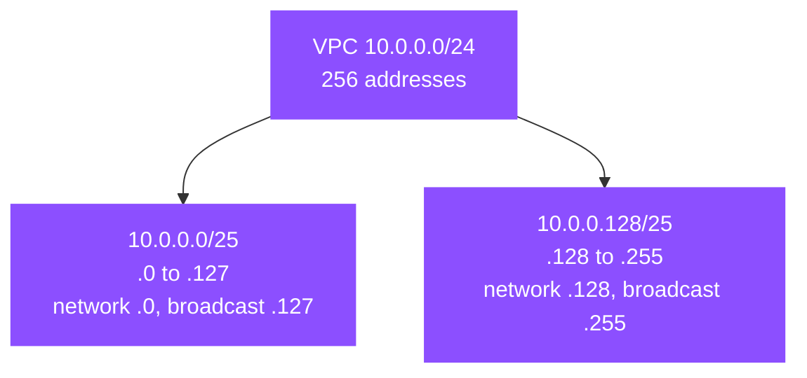

# IP addressing concepts

## IPv4 addressing

An IPv4 address is 32 bits, written as four decimal octets (`0`–`255`) separated by dots:

```text
10  .  0   .  0   . 16
00001010.00000000.00000000.00010000   ← the same address in binary
```

Subnetting works on the binary form. Each octet is 8 bits; four octets make 32.

## CIDR notation

CIDR (Classless Inter-Domain Routing) writes a network as `a.b.c.d/n`, where `n` is the **prefix length**, the count of leading bits that identify the *network*. The remaining `32 − n` bits identify *hosts* in that network.

- `/24` → 24 network bits, 8 host bits.
- `/16` → 16 network bits, 16 host bits.

The number of addresses in a block is `2^(32 − n)`:

| Prefix | Host bits | Addresses |
|--------|-----------|-----------|
| `/16` | 16 | 65,536 |
| `/20` | 12 | 4,096 |
| `/24` | 8 | 256 |
| `/25` | 7 | 128 |
| `/27` | 5 | 32 |
| `/28` | 4 | 16 |
| `/32` | 0 | 1 (a single host) |

## Network and broadcast

The first address in a block (all host bits `0`) is the **network address**. The last (all host bits `1`) is the **broadcast address**. Classic IPv4 reserves both, so a plain network has `2^(32−n) − 2` usable addresses. AWS is stricter and reserves **five** per subnet (see [02-aws-addressing.md](02-aws-addressing.md)).

## Subnet math (worked)

Take `10.0.0.0/24`:

- `2^(32−24) = 2^8 = 256` addresses, from `10.0.0.0` to `10.0.0.255`.
- Network = `10.0.0.0`, broadcast = `10.0.0.255`, range = `10.0.0.1`–`10.0.0.254`.

Split it into two `/25` subnets. Each half moves the prefix one bit longer and halves the range:

- `10.0.0.0/25` → `10.0.0.0` – `10.0.0.127`
- `10.0.0.128/25` → `10.0.0.128` – `10.0.0.255`



A `/28` (`10.0.0.0/28`) has `2^4 = 16` addresses, `10.0.0.0` to `10.0.0.15`. That is the smallest subnet AWS allows.

To size a subnet, count the resources you need, add the 5 reserved, and round **up** to the next power of two. Need 20 instances? 20 + 5 = 25, so take a `/27` (32 addresses), not a `/28` (16).

> [!CAUTION]
> Address space is global to your network, not local to one VPC. VPC CIDR blocks **must not overlap** for VPC peering, Transit Gateway attachments, or a Direct Connect gateway, and an overlapping block makes the peering request fail outright rather than connecting partway. Plan non-overlapping ranges across every VPC and account before provisioning, once an overlap exists, the only fix is to rebuild one side, because neither VPC's CIDR can be resized.

## Sources

- AWS: *Subnet CIDR blocks*. https://docs.aws.amazon.com/vpc/latest/userguide/subnet-sizing.html
- AWS: *VPC CIDR blocks*. https://docs.aws.amazon.com/vpc/latest/userguide/vpc-cidr-blocks.html
