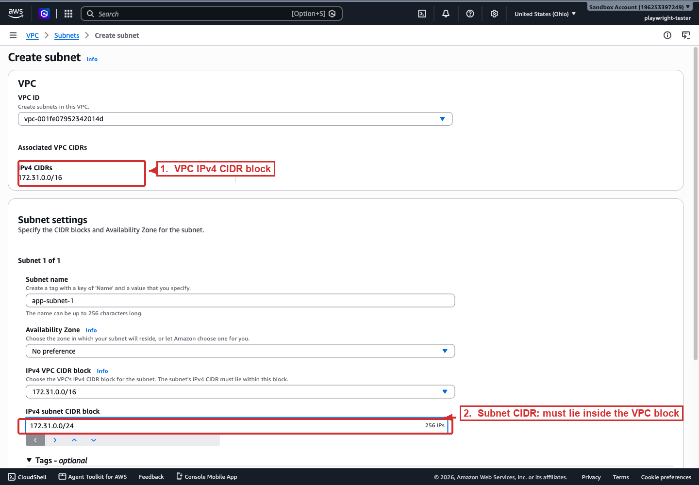

# AWS addressing rules

How AWS applies CIDR when you create VPCs and subnets, and the reserved addresses you lose along the way.

## VPC CIDR blocks

A VPC must have an IPv4 CIDR block, with a size between `/16` (65,536 addresses) and `/28` (16 addresses). You can add secondary IPv4 blocks and IPv6 blocks later.

> [!IMPORTANT]
> A VPC's IPv4 CIDR must be between `/16` (65,536 addresses) and `/28` (16 addresses); a subnet must be between `/28` and `/16`. Critically, **you cannot resize a CIDR block after creation**, not larger, not smaller. To grow address space you add a *secondary* non-overlapping CIDR block, and you cannot remove or shrink the primary block. A scenario that says "the VPC ran out of addresses" expects "add a secondary CIDR", not "resize the VPC".

Additional blocks must be non-overlapping, and a block can't equal or exceed an existing route-table destination of the same size. The primary CIDR cannot be disassociated.

## Subnet CIDR blocks

A subnet's range is a subset of the VPC CIDR. Subnets in the same VPC cannot overlap.

AWS reserves **five** addresses in every IPv4 subnet: the first four and the last. For `10.0.0.0/24`:

| Address | Reserved for | Purpose |
|---------|--------------|---------|
| `10.0.0.0` | Network address | Identifies the subnet block itself; never assigned to a resource. |
| `10.0.0.1` | VPC router | The subnet's default gateway; routes traffic into and out of the VPC. |
| `10.0.0.2` | DNS | Amazon Route 53 Resolver, the VPC's DNS server, located at the VPC range base + 2. |
| `10.0.0.3` | Future use | Held by AWS for future functionality; not assignable. |
| `10.0.0.255` | Broadcast | AWS does not support broadcast; the address is held but never used. |

> [!IMPORTANT]
> AWS reserves **five** addresses in every IPv4 subnet: the network address, the VPC router (`.1`), the DNS server (VPC range base + 2, i.e. `.2`), one for future use (`.3`), and the broadcast address (the last address). Usable addresses therefore equal `2^(32 − n) − 5`, not the `− 2` you may have learned for plain IPv4. A `/28` gives 11 usable addresses, not 14. Any sizing question that ignores the extra three AWS reservations will get the wrong answer.

So a `/24` subnet yields `256 − 5 = 251` usable addresses, and a `/28` yields `16 − 5 = 11`.

Creating the range and a subnet inside it, as CLI calls:

```bash
# VPC with a /16 (65,536 addresses)
aws ec2 create-vpc --cidr-block 10.0.0.0/16

# A /24 subnet carved from it, 251 usable addresses after the 5 reservations
aws ec2 create-subnet --vpc-id vpc-0abc123 --cidr-block 10.0.1.0/24
```

The subnet CIDR (`10.0.1.0/24`) sits entirely inside the VPC CIDR (`10.0.0.0/16`) and does not overlap any other subnet. AWS rejects a subnet outside the VPC range, and rejects one that overlaps an existing subnet in the same VPC.

The console enforces that containment while you fill in the form. The screenshot below shows the Create subnet screen, where the VPC's range is shown above the field for the subnet's own CIDR.



*The Create subnet form. The subnet's IPv4 CIDR block (2) must lie inside the VPC's IPv4 CIDR block (1). The console counts the addresses as you type, 256 IPs for the `/24` above, before the five AWS reservations are subtracted.*

## Private vs public IP

- **Private IP**, an address inside your VPC CIDR, typically from the RFC 1918 ranges. Not routable on the internet.
- **Public IP**, a globally routable address attached to an instance or NAT gateway. AWS assigns it from its pool, either auto-assigned (changes on stop/start) or an Elastic IP you keep.
- The private-to-public mapping is done by NAT, the internet gateway for an instance's own public IP, or a NAT gateway for outbound traffic from private subnets. Instances in private subnets never hold a public IP.

## Allowed and prohibited ranges

AWS recommends the RFC 1918 private ranges for VPCs:

| Range | Prefix |
|-------|--------|
| `10.0.0.0` – `10.255.255.255` | `10.0.0.0/8` |
| `172.16.0.0` – `172.31.255.255` | `172.16.0.0/12` |
| `192.168.0.0` – `192.168.255.255` | `192.168.0.0/16` |

You cannot use these for a VPC CIDR: `0.0.0.0/8`, `127.0.0.0/8` (loopback), `169.254.0.0/16` (link-local), `224.0.0.0/4` (multicast). Some AWS services use `172.17.0.0/16` internally (Cloud9, SageMaker AI), so avoid it to prevent conflicts.

AWS stores a CIDR in canonical form: `100.68.0.18/18` becomes `100.68.0.0/18`. If you bring your own IP (BYOIP), you may use the network and broadcast addresses, unlike an AWS-owned range.

## Sources

- AWS: *VPC CIDR blocks*. https://docs.aws.amazon.com/vpc/latest/userguide/vpc-cidr-blocks.html
- AWS: *Subnet CIDR blocks*. https://docs.aws.amazon.com/vpc/latest/userguide/subnet-sizing.html
- AWS: *IP addressing for your VPCs and subnets*. https://docs.aws.amazon.com/vpc/latest/userguide/vpc-ip-addressing.html
