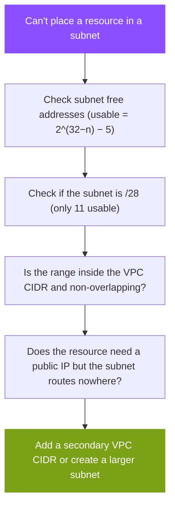
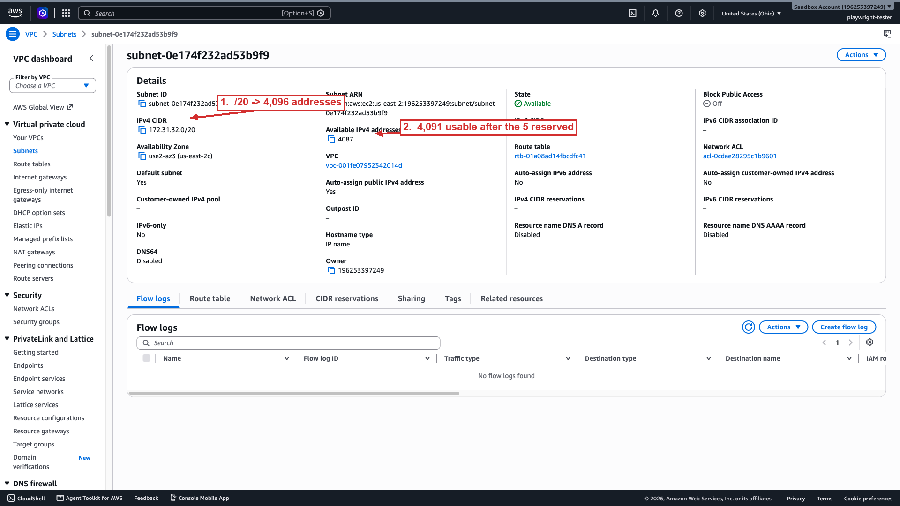

# IP addressing troubleshooting

Most CIDR problems surface as one of two symptoms: a subnet runs out of addresses, or two networks cannot connect. Work the first as a capacity problem and the second as an overlap problem; they have different causes and different fixes.



## Symptom table

| Symptom | Likely cause | Fix |
|---------|--------------|-----|
| "Insufficient free addresses" in a subnet | The subnet exhausted its usable range, the 5 reserved addresses are gone first | Launch in another subnet, or build a larger subnet from a secondary VPC CIDR |
| VPC peering or Transit Gateway attach fails | The two CIDRs overlap | Re-address one side (CIDRs cannot be resized) |
| Can't add a secondary CIDR | It overlaps an existing block, or equals a route-table destination of the same size | Pick a non-overlapping range |
| Resource can't be created in a range | The CIDR is a prohibited block (`127.0.0.0/8`, `169.254.0.0/16`, etc.) | Choose an RFC 1918 range |
| Can't remove a CIDR | It is the primary VPC CIDR | Only secondary blocks can be disassociated |
| VPC creation rejected | The block is smaller than `/28` or larger than `/16` | Choose a valid prefix |

## The capacity check

When a subnet is full, confirm the real usable count before rebuilding. A `/28` holds 16 addresses and only 11 usable; a `/24` holds 251 usable. The five reserved addresses are gone before any instance is launched, so a subnet that reports "full" at 251 instances on a `/24` is behaving correctly. Because a subnet cannot be resized, the fixes are to place the resource in a different subnet, or to build a larger subnet from a secondary VPC CIDR block.

Inspect the numbers directly with the Amazon EC2 CLI:

```bash
# The VPC's IPv4 CIDR blocks
aws ec2 describe-vpcs --vpc-ids vpc-0abc123 \
  --query 'Vpcs[].CidrBlockAssociationSet[].CidrBlock'

# A subnet's CIDR and how many addresses remain
aws ec2 describe-subnets --subnet-ids subnet-0abc123 \
  --query 'Subnets[].[CidrBlock,AvailableIpAddressCount]'
```

`AvailableIpAddressCount` already excludes the five reserved addresses, so it is the number of addresses you can actually assign, not the raw `2^(32−n)` total.



*A subnet's details page. The IPv4 CIDR (1) sets the block size, and Available IPv4 addresses (2) is what remains after the five reservations and any resources already placed. Here the `/20` holds 4,096 addresses (4,091 usable) and reports 4,087 free, because four are consumed.*

## The connectivity check

When peering or a Transit Gateway attachment fails to connect, compare the two CIDRs for overlap before anything else. Any overlap is fatal: the request fails rather than connecting partially, and it fails at the control plane, so nothing appears in flow logs. Because neither VPC's CIDR can be resized, the fix is to re-address one side, which is why address planning precedes provisioning.

## The gateway check

A resource that is correctly addressed but still cannot reach the internet is usually a routing problem, not a CIDR problem. Confirm the subnet's route table has a route to an internet gateway (for a public subnet) or a NAT gateway (for a private subnet), and that an internet gateway or NAT gateway is attached to the VPC at all. This is where IP addressing hands off to the Routing concept (planned).

## Sources

- AWS: *VPC CIDR blocks*. https://docs.aws.amazon.com/vpc/latest/userguide/vpc-cidr-blocks.html
- AWS: *Subnet CIDR blocks*. https://docs.aws.amazon.com/vpc/latest/userguide/subnet-sizing.html
- AWS: *Amazon VPC quotas*. https://docs.aws.amazon.com/vpc/latest/userguide/amazon-vpc-limits.html
