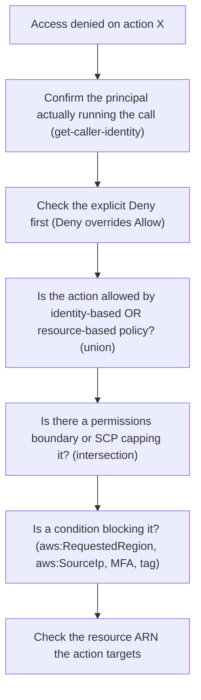

# IAM troubleshooting

Access-denied is the most common IAM failure, and almost every case reduces to one of three things: an explicit deny somewhere in the chain, a missing allow, or a condition that did not match. Work it as a chain, not a guess.

> [!TIP]
> Start with the **IAM policy simulator** before any live call. It evaluates the effective permissions of a principal against a specific action and resource ARN and reports allow or deny plus the reason, without you triggering the real request or waiting for CloudTrail. Only when the simulator says "allowed" but the live call still fails do you reach for CloudTrail, the boundary/SCP, and `DecodeAuthorizationMessage`.

## Diagnose in order

1. **Confirm the principal.** `aws sts get-caller-identity` shows which identity and account the call is actually using. It is often not the one you assumed — a stale `AWS_PROFILE`, an environment variable access key overriding a role, or an instance role instead of a user.
2. **Look for an explicit deny.** A `Deny` anywhere — identity policy, resource policy, permissions boundary, or SCP — overrides every `Allow`. This is the most common cause of a request that "should" be allowed but isn't.
3. **Check for an allow.** If nothing explicitly allows the action, the implicit deny applies. Remember that identity and resource policies combine as a union for same-account access, so an allow in either one is enough.
4. **Check the boundary and SCP.** These are intersections: even with a valid allow, the action must also be permitted by the permissions boundary and by any SCP on the account.
5. **Check conditions.** A condition that fails blocks an otherwise-allowed action — `aws:RequestedRegion`, `aws:SourceIp`, `aws:MultiFactorAuthPresent`, or a resource tag condition.
6. **Check the resource ARN.** A policy that allows `s3:GetObject` but names the wrong bucket ARN will deny the real request.

## Tools

- **IAM policy simulator** — evaluates a policy set against a specific action and resource without making a live call. First stop for "why is this denied."
- **CloudTrail** — records the API call, the principal, and whether access was denied. Search for the error code (`AccessDenied`) and the caller identity.
- **IAM Access Analyzer** — finds policies that grant external access to a resource; it also validates policy syntax and IAM grammar.
- **`DecodeAuthorizationMessage`** — decodes the encoded authorization failure in an `AccessDenied` response into the reason and the matched policy, which is faster than reproducing the call.

## Common causes

| Symptom | Likely cause |
|---------|--------------|
| Denied even though the policy looks right | An explicit `Deny` elsewhere, or a boundary/SCP |
| Role works in the console but not the CLI | Wrong credential chain; a stale access key in the environment |
| EC2 application can't reach S3 | The instance has no role, the wrong role, or no instance profile |
| Cross-account call fails | The trust policy is missing the caller ARN, or the identity policy is missing the action |
| A new policy still denies | The policy has not propagated yet, or it names the wrong resource ARN |

## The decisive rule

When two policies disagree, **deny wins**. If you see an allow and a deny for the same action, the deny is what AWS enforces. Most "mystery" access failures trace back to an overlooked deny in a permissions boundary, an SCP, or an old inline policy that was never removed.

## Sources

- AWS — *IAM policy simulator*. https://docs.aws.amazon.com/IAM/latest/UserGuide/access_policies_testing-policies.html
- AWS — *IAM Access Analyzer*. https://docs.aws.amazon.com/IAM/latest/UserGuide/what-is-access-analyzer.html
- AWS — *Logging IAM and AWS STS API calls with CloudTrail*. https://docs.aws.amazon.com/IAM/latest/UserGuide/cloudtrail-integration.html
