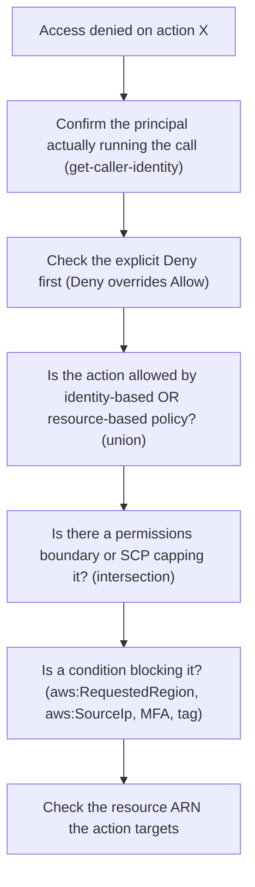

# IAM troubleshooting

Access-denied is the most common IAM failure. Work it as a chain, not a guess.

> [!TIP]
> Start with the **IAM policy simulator** before any live call. It evaluates the effective permissions of a principal against a specific action and resource ARN and reports allow or deny plus the reason, without you triggering the real request or waiting for CloudTrail. Only when the simulator says "allowed" but the live call still fails do you reach for CloudTrail, the boundary/SCP, and `DecodeAuthorizationMessage`.

## Tools

- **IAM policy simulator** — evaluates a policy set against a specific action and resource without making a live call. First stop for "why is this denied."
- **CloudTrail** — records the API call, the principal, and whether access was denied. Search for the error code (`AccessDenied`) and the caller.
- **IAM Access Analyzer** — finds policies that grant external access to a resource; also validates policies for syntax and IAM grammar.
- **`DecodeAuthorizationMessage`** — decodes an encoded authorization failure from an `AccessDenied` response into the reason and matched policy.

## Common causes

| Symptom | Likely cause |
|---------|--------------|
| Denied even though policy looks right | Explicit `Deny` elsewhere, or a boundary/SCP |
| Role works in console but not CLI | Wrong credential chain; stale access key in env |
| EC2 app can't reach S3 | Instance has no role / wrong role / no instance profile |
| Cross-account call fails | Trust policy missing the caller ARN, or identity policy missing the action |
| New policy still denies | Policy not yet propagated, or wrong resource ARN |

## The decisive rule

When two policies disagree, **deny wins**. If you see an allow and a deny for the same action, the deny is what AWS enforces. Most "mystery" access failures trace back to an overlooked deny in a boundary, SCP, or an old inline policy.

## Sources

- AWS — *IAM policy simulator*. https://docs.aws.amazon.com/IAM/latest/UserGuide/access_policies_testing-policies.html
- AWS — *IAM Access Analyzer*. https://docs.aws.amazon.com/IAM/latest/UserGuide/what-is-access-analyzer.html
- AWS — *Logging IAM and AWS STS API calls with CloudTrail*. https://docs.aws.amazon.com/IAM/latest/UserGuide/cloudtrail-integration.html
