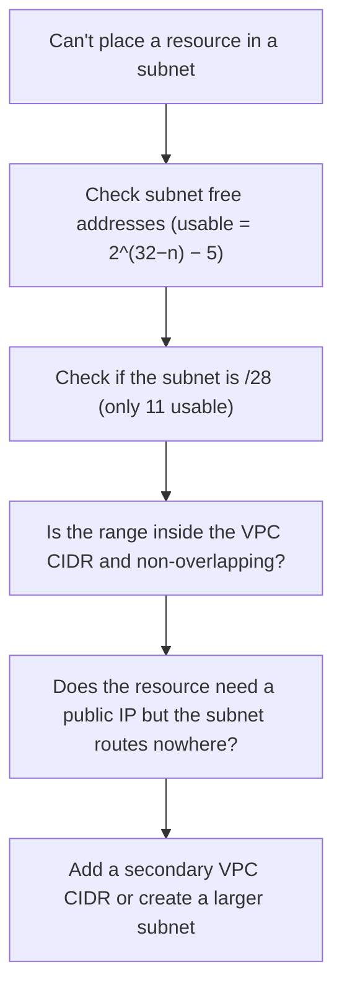

# IP addressing troubleshooting

Most CIDR problems surface as one of two symptoms: a subnet runs out of addresses, or two networks cannot connect.

## Symptom table

| Symptom | Likely cause |
|---------|--------------|
| "Insufficient free addresses" in a subnet | Subnet exhausted its usable range — remember the 5 reserved |
| VPC peering / TGW attach fails | Overlapping CIDRs between the two networks |
| Can't add a secondary CIDR | It overlaps an existing block, or a route-table destination of the same size exists |
| Resource can't be created in a range | CIDR is a prohibited block (`127.0.0.0/8`, `169.254.0.0/16`, etc.) |
| Can't remove a CIDR | It is the primary VPC CIDR — the primary cannot be disassociated |

## The sizing check

When a subnet is full, confirm usable capacity before rebuilding. A `/28` holds only 11 usable addresses (16 minus 5). If a subnet needs more, it cannot be resized — create a new, larger subnet and move resources, or attach a secondary VPC CIDR and build a larger subnet from it.

## The connectivity check

When peering or a Transit Gateway attachment fails to connect, compare the two CIDRs. Any overlap is fatal: the request fails rather than connecting partially. Because CIDRs cannot be resized, the fix is to re-address one side.

## Sources

- AWS — *VPC CIDR blocks*. https://docs.aws.amazon.com/vpc/latest/userguide/vpc-cidr-blocks.html
- AWS — *Subnet CIDR blocks*. https://docs.aws.amazon.com/vpc/latest/userguide/subnet-sizing.html
