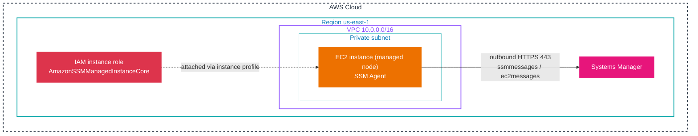

# Systems Manager fundamentals

Before any Systems Manager capability works, three things must be true of a machine: the **SSM Agent** is installed and running, the agent can reach the **Systems Manager service endpoints**, and the machine has an **IAM role** that authorizes it to register. When those hold, the machine appears as a *managed node* and Systems Manager can act on it. This document explains each piece and the Default Host Management Configuration that removes the manual IAM step for EC2.

## Managed nodes

A node is *managed* when SSM Agent is installed on it and the agent has successfully registered with the Systems Manager service in its Region. Managed node types are:

- **EC2 instances**, the most common case.
- **On-premises servers and VMs**, registered through a hybrid activation (covered in [02-node-tools.md](02-node-tools.md)).
- **Edge devices**, including AWS IoT Greengrass core devices.

If an instance is not controlled by Systems Manager, the cause is almost always one of three things: the SSM Agent is missing or stopped, the instance has no IAM role that allows registration, or the agent cannot reach the endpoints (a route, security-group, or VPC-endpoint problem). That ordering is also the diagnostic order in [12-troubleshooting.md](12-troubleshooting.md).

## The SSM Agent

SSM Agent is AWS software that runs on the node. The service never opens an inbound connection to the node; instead the agent polls the service for work, runs the requested action, and reports status back. This is why Systems Manager can manage a node with no inbound ports open and no bastion host.

- **Preinstalled.** AWS-provided AMIs ship with SSM Agent already installed on Amazon Linux, Amazon Linux 2, Amazon Linux 2023, Ubuntu Server, and Windows Server. On those, no install step is needed.
- **Manual install otherwise.** Other AMIs (many third-party and hardened images) require installing the agent yourself.
- **Communication.** The agent connects outbound over HTTPS (TCP 443) to the Systems Manager endpoints. In newer Regions it uses `ssmmessages.*`; in Regions launched before 2024 it may also use `ec2messages.*`. No inbound rule is required.
- **Self-update.** SSM Agent can update itself once registered. Default Host Management Configuration keeps it current automatically.

The practical consequence: a node in a private subnet with no internet route still becomes manageable if it has a path to the endpoints, either through a NAT gateway or, preferably, a VPC interface endpoint.

Architecture, a private EC2 instance managed with no inbound access:



The diagram shows the whole model in one view: the agent on the instance initiates an outbound connection to the Systems Manager service, the instance carries an IAM role through an instance profile, and the private subnet needs no inbound rule because every connection is outbound. Registration is the agent introducing itself to the service; after that, the service can push Run Command, Session Manager, Patch Manager, and Inventory work over the same channel.

## The instance IAM role

The node needs permissions to talk to Systems Manager. The standard way is to attach an IAM role to the instance through an **instance profile**. AWS provides a managed policy for exactly this purpose, `AmazonSSMManagedInstanceCore`.

A trust policy that lets EC2 assume the role, and the managed policy attached:

```json
{
  "Version": "2012-10-17",
  "Statement": [{
    "Effect": "Allow",
    "Principal": { "Service": "ec2.amazonaws.com" },
    "Action": "sts:AssumeRole"
  }]
}
```

```bash
# Create a role for managed instances and attach the core policy
aws iam create-role --role-name SSMInstanceRole \
  --assume-role-policy-document file://trust.json

aws iam attach-role-policy --role-name SSMInstanceRole \
  --policy-arn arn:aws:iam::aws:policy/AmazonSSMManagedInstanceCore
```

`AmazonSSMManagedInstanceCore` grants the agent the exact calls it needs, in particular `ssm:UpdateInstanceInformation` (registration), the `ssmmessages` and `ec2messages` calls (the command and session channels), and CloudWatch Logs write for agent logs. It does **not** grant broad access to your other resources; that is intentional, and you add only what a given capability needs.

> [!IMPORTANT]
> A policy named `AmazonSSMManagedInstanceCore` on the role is necessary but not sufficient. `ssm:UpdateInstanceInformation` is what flips a node from *not managed* to *managed*. If you attach a custom policy that omits it, the agent registers incompletely or not at all, and the node stays invisible in Fleet Manager even though the agent is installed and running. Check this permission first when a node will not appear.

## Default Host Management Configuration

Normally you create a role and attach it to every instance. Default Host Management Configuration removes that step for EC2: activate it once per account and Region, and Systems Manager manages the account's EC2 instances automatically without an instance profile.

- **What it does.** Creates and applies a default IAM role, `AWSSystemsManagerDefaultEC2InstanceManagementRole`, so Systems Manager has permission to manage all instances in that Region and account.
- **What it enables.** Session Manager, Patch Manager, and Inventory, and it keeps SSM Agent updated automatically.
- **Requirements.** The instance must use **IMDSv2** (IMDSv1 is not supported), and SSM Agent **3.2.582.0 or later** must be installed.
- **Scope.** Activated per account and per Region; the role applies to every managed EC2 instance in that scope.
- **Precedence.** If an instance profile is also attached, SSM Agent uses the instance profile first. An instance profile that allows `ssm:UpdateInstanceInformation` will therefore stop the instance from using the Default Host Management Configuration permissions.

> [!IMPORTANT]
> Default Host Management Configuration needs IMDSv2 and SSM Agent 3.2.582.0 or later, and it is enabled **per Region**, not once for the whole account. A scenario that says "instances in a new Region are unmanaged" after DHMC was enabled in one Region is testing exactly this per-Region scope. It also does not support IMDSv1, so an instance still on IMDSv1 must be transitioned first.

## Verifying a managed node

Once the agent, role, and network path are in place, confirm registration with the CLI rather than assuming it:

```bash
# List nodes known to Systems Manager in this Region, with ping and platform
aws ssm describe-instance-information \
  --query 'InstanceInformationList[].[InstanceId,PingStatus,PlatformType,AgentVersion]' \
  --output table
```

A node that shows `PingStatus: Online` is registered and reachable; `ConnectionLost` means the agent registered before but is not currently reaching the service. `AgentVersion` is worth reading because some features have minimum agent versions, Session Manager for example needs 2.3.68.0 or later.

## Sources

- AWS: *What is AWS Systems Manager?*. https://docs.aws.amazon.com/systems-manager/latest/userguide/what-is-systems-manager.html
- AWS: *Working with SSM Agent*. https://docs.aws.amazon.com/systems-manager/latest/userguide/ssm-agent.html
- AWS: *Managing EC2 instances automatically with Default Host Management Configuration*. https://docs.aws.amazon.com/systems-manager/latest/userguide/fleet-manager-default-host-management-configuration.html
- AWS: *AWS managed policy: AmazonSSMManagedInstanceCore*. https://docs.aws.amazon.com/systems-manager/latest/userguide/security-iam-awsmanpol.html
- AWS: *Reference: ec2messages, ssmmessages, and other API operations*. https://docs.aws.amazon.com/systems-manager/latest/userguide/systems-manager-setting-up-messageAPIs.html
