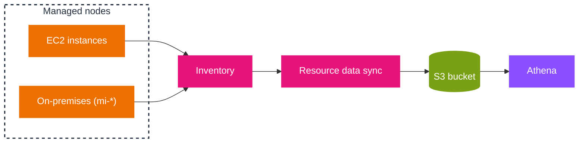

# Systems Manager node tools

Systems Manager groups its node-focused capabilities into a few tools that you reach from the unified console: a fleet view, a compliance view, an inventory of what is installed, and the activation path that brings non-EC2 machines under management. This document covers Fleet Manager, Compliance, Inventory, and Hybrid Activations. Remote access (Session Manager, Run Command) and state enforcement (State Manager) are covered in [03-session-run-state.md](03-session-run-state.md), and patching in [04-patch-manager.md](04-patch-manager.md).

## Fleet Manager

Fleet Manager is a unified console for remotely managing nodes that run on AWS or on-premises. It is the operator's view: you see the whole fleet's health and performance in one place, then drill into one node to perform common administration without opening an SSH or RDP client.

- **Node status.** Running versus stopped for EC2 instances; online, offline, or `Connection lost` for AWS IoT Greengrass core devices.
- **Remote actions.** Connect to Windows instances over RDP, browse folders and files, edit the Windows registry, manage OS user accounts and groups, view logs and running processes, and manage EBS volumes.
- **Platform coverage.** Manage nodes running different operating systems from the same console.
- **Access control.** Which features a user can use, and on which nodes, is controlled by IAM policies.

The distinction worth remembering: Fleet Manager is the **console/GUI** path to a node, while Session Manager is the **shell/session** path. Both reach the same managed nodes, and both are governed by IAM rather than by open inbound ports.

## Compliance

Compliance scans managed nodes for **patch compliance and configuration inconsistencies** and aggregates the results so you can find non-compliant resources. It does not collect its own data; it surfaces what two other tools already produce.

- **What it shows by default.** Patching status from Patch Manager and association status from State Manager.
- **Aggregation.** A resource data sync collects results across multiple accounts and Regions into one place.
- **Integrations.** Patch compliance can be sent to AWS Security Hub CSPM; compliance history and change tracking are available through AWS Config.
- **Custom compliance.** You can define your own compliance types for IT or business requirements.
- **Remediation.** Drive fixes through Run Command, State Manager, or EventBridge.
- **Chef InSpec.** Run InSpec profiles as compliance scans.
- **Cost.** No additional charge; you pay only for the resources used.

## Inventory

Inventory collects **metadata** from managed nodes so you can answer "which nodes are running this software or configuration". It collects metadata only, never proprietary data.

- **Metadata types.** Applications, AWS components, files, network configuration, Windows updates, instance details (CPU model, cores, speed), services, tags, Windows registry and roles, and custom inventory.
- **Targeting.** All managed nodes in the account, selected nodes, or tag-based groups.
- **Collection interval.** Configurable in minutes, hours, or days; the shortest interval is every 30 minutes.
- **Storage and querying.** Data can be sent to a central S3 bucket with a resource data sync, then queried across accounts and Regions with Athena (and visualized with QuickSight or Amazon Quick).
- **Custom inventory.** A JSON file placed in a specific directory on the node, collected alongside built-in data. A common example is recording the physical rack location of each server.
- **Events.** Inventory is supported as an EventBridge event type.

The reporting path is worth a picture: each node reports its metadata to Inventory, a resource data sync lands it in S3, and Athena queries the aggregated store across accounts and Regions.



The diagram shows where the cross-account, cross-Region reporting capability comes from: the resource data sync is the component that centralizes each node's metadata into one S3 bucket, and Athena is what turns that bucket into fleet-wide queries. Without the sync, inventory data is per-Region in the console and cannot be queried as one dataset.

## Hybrid Activations

Hybrid activations bring **non-EC2 machines** under management: on-premises servers, edge devices, and VMs, including machines in other clouds. A machine registered this way is a managed node with an ID prefixed `mi-` (EC2 instances use `i-`).

- **Two onboarding paths.** *Cloud Connectors* automatically onboard and manage Microsoft Azure VMs at scale (identity federation, agent installation, and registration handled for you). *Hybrid activations* register an individual machine you install SSM Agent on manually, using an activation code and ID.
- **Any environment.** Hybrid activations work from on-premises data centers, edge locations, and cloud providers not yet covered by Cloud Connectors.
- **Edge devices.** Registered with the same hybrid-activation steps; AWS IoT Greengrass core devices have their own setup.
- **Not supported.** Non-EC2 macOS machines are not supported for hybrid and multicloud management.
- **Pricing change.** The paid *advanced-instances tier* was removed on June 30, 2026, so there is no longer a 1,000-node limit for hybrid managed nodes. From September 30, 2026, Session Manager and Run Command use pay-as-you-go pricing when used on hybrid managed nodes.

A hybrid activation is a one-time registration credential: you create it, install the agent on each machine, and register each machine with the activation code and ID. Treat the activation code as a secret, because anyone who holds it can register a node into your account.

## Example

Configure account-wide Inventory on a 30-minute interval, then list the fleet's registration state:

```bash
# Collect software inventory from all managed nodes every 30 minutes
aws ssm create-association \
  --name "AWS-GatherSoftwareInventory" \
  --targets "Key=InstanceIds,Values=*" \
  --schedule-expression "rate(30 minutes)"

# Which nodes are registered, and are they online?
aws ssm describe-instance-information \
  --query 'InstanceInformationList[].[InstanceId,PingStatus,PlatformType]' --output table
```

## Sources

- AWS: *AWS Systems Manager Fleet Manager*. https://docs.aws.amazon.com/systems-manager/latest/userguide/fleet-manager.html
- AWS: *AWS Systems Manager Compliance*. https://docs.aws.amazon.com/systems-manager/latest/userguide/systems-manager-compliance.html
- AWS: *AWS Systems Manager Inventory*. https://docs.aws.amazon.com/systems-manager/latest/userguide/systems-manager-inventory.html
- AWS: *Managing nodes in hybrid and multicloud environments with Systems Manager*. https://docs.aws.amazon.com/systems-manager/latest/userguide/systems-manager-hybrid-multicloud.html
