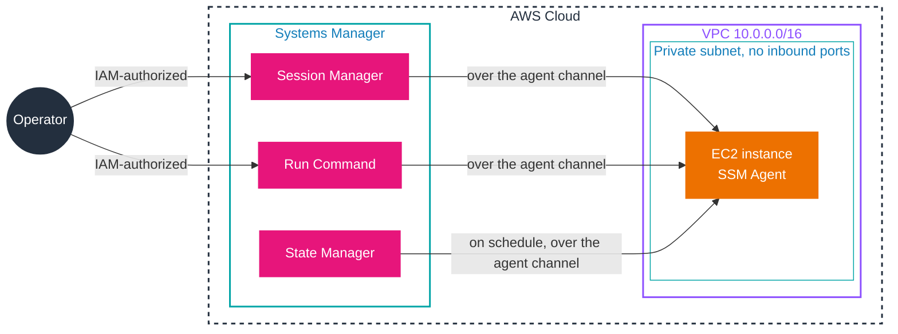

# Session Manager, Run Command, and State Manager

Three tools cover the day-to-day act of operating a node: getting a shell on it, running a command on it once, and keeping it in a defined state over time. They share one mechanism, the SSM Agent's outbound channel, which is why none of them needs an inbound port, a bastion host, or an SSH key. This document treats each in turn, then the comparison that decides which one an exam scenario is asking for.

## Session Manager

Session Manager gives you an interactive shell or a one-shot command channel to a managed node, through either a browser-based shell or the AWS CLI, with no need to open inbound ports, maintain bastion hosts, or manage SSH keys.

- **Access control through IAM.** Access to nodes is granted and revoked with IAM policies, not SSH keys, so a single place governs who can reach which node.
- **Session types.** Interactive shell sessions; port forwarding (redirect a port inside the node to a local client port); SSH sessions; and non-interactive command sessions.
- **Cross-platform.** Windows, Linux, and macOS from the same tool, so you do not need an SSH client for Linux or an RDP client for Windows.
- **Logging.** Session activity can be recorded to CloudTrail (API calls), Amazon S3, and CloudWatch Logs, and start/stop events can drive EventBridge rules and SNS notifications.
- **Logging gap.** Session logging is **not** available for sessions that connect through port forwarding or SSH, because the session data is encrypted inside the TLS tunnel and cannot be captured by the shell logger.

The security argument is the point: replacing inbound SSH (port 22) and RDP (port 3389) with IAM-authorized sessions removes the exposed attack surface, and every session is attributable to an IAM principal.

## Run Command

Run Command runs commands on managed nodes remotely, at scale, for one-time changes. It is the "run this now" tool.

- **What it runs.** SSM documents, either AWS-provided or yours, issued to one or many nodes.
- **Where from.** The console, AWS CLI, AWS Tools for Windows PowerShell, or the AWS SDKs.
- **Typical uses.** Install or bootstrap applications, run a deployment step, capture logs when a node leaves an Auto Scaling group, or join instances to a Windows domain.
- **Cost.** No additional charge.
- **Consistency.** The Run Command API is eventually consistent, so a command that follows immediately after another may not yet see its effect.
- **Events.** Supported as both an event type and a target type in EventBridge rules.

## State Manager

State Manager automates the process of keeping managed nodes and other AWS resources in a state you define. Where Run Command acts once, State Manager acts on a schedule until the state holds.

A **State Manager association** is a configuration assigned to targets. It names the document that enforces the state, the targets, and the schedule.

- **Examples of state.** Antivirus installed and running; specific ports closed; a configuration file present. If the state is not met, the association acts to reach it.
- **Scheduling.** Cron and rate expressions, including the `#` (nth weekday of the month) and `L` (last day) modifiers, plus an *offset* in days (useful for running after a patch cycle). By default an association runs immediately on creation and then on schedule; set `ApplyOnlyAtCronInterval` to skip the immediate run. Months are not supported in cron expressions.
- **Targeting.** Tags, AWS Resource Groups, individual node IDs, or all managed nodes in the current account and Region.
- **Output.** Command output can be stored in S3.
- **Automation.** To act on resources beyond nodes, State Manager schedules Automation runbooks: for example, attaching an SSM role to instances, enforcing security-group rules, creating DynamoDB backups or EBS snapshots, or starting and stopping instances and RDS databases.
- **Events.** Supported as both an event type and a target type in EventBridge rules.

## The shared access model

All three tools reach the node the same way, which is why the network diagram looks the same for each: the operator is authorized by IAM, the Systems Manager service sends work, and the agent on the node carries it out over its existing outbound connection. No connection is ever initiated from the service into the node.



Read the arrows from right to left: the instance is the one that holds the connection open, and the service can only send work because the agent keeps that channel alive. The three tool boxes differ only in what they send and when. This is why a node with a stopped agent is unreachable to all three at once, and it is the first thing to check when sessions or commands fail.

## Choosing between them

| Question the scenario asks | Tool |
|----------------------------|------|
| "Open a shell, or tunnel a port, without SSH or a bastion" | Session Manager |
| "Run a command on many nodes once" | Run Command |
| "Keep a configuration applied on an ongoing schedule" | State Manager |
| "Run a high-priority task inside a defined change window" | Maintenance Windows (covered in [06-change-management.md](06-change-management.md)) |

## Examples

Start an interactive session, run a command once, and create an association that runs daily:

```bash
# Interactive shell on a managed node (no SSH, no open inbound port)
aws ssm start-session --target i-0123456789abcdef0

# Run a command once on nodes tagged by environment
aws ssm send-command \
  --document-name "AWS-RunShellScript" \
  --targets "Key=tag:Environment,Values=dev" \
  --parameters 'commands=["sudo yum -y update"]'

# Keep a state applied every day at 03:00 UTC
aws ssm create-association \
  --name "AWS-ConfigureAWSPackage" \
  --targets "Key=tag:OS,Values=linux" \
  --schedule-expression "cron(0 3 * * ? *)"
```

## Sources

- AWS: *AWS Systems Manager Session Manager*. https://docs.aws.amazon.com/systems-manager/latest/userguide/session-manager.html
- AWS: *AWS Systems Manager Run Command*. https://docs.aws.amazon.com/systems-manager/latest/userguide/run-command.html
- AWS: *AWS Systems Manager State Manager*. https://docs.aws.amazon.com/systems-manager/latest/userguide/systems-manager-state.html
- AWS: *Choosing between State Manager and Maintenance Windows*. https://docs.aws.amazon.com/systems-manager/latest/userguide/state-manager-vs-maintenance-windows.html
