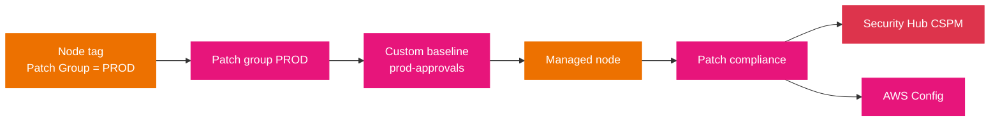

# Patch Manager

Patch Manager automates patching managed nodes with security and other updates. It answers two questions: which patches should a node have, and does it have them. The first is defined by a *patch baseline*; the second is reported as *patch compliance*. The bridge between the two is the *patch group*, a tag that tells a node which baseline applies to it.

## What it does

- **Operating system and application patches.** Patch Manager applies OS patches and, within limits, application patches. On Windows Server, application patching covers only updates released by Microsoft.
- **Scan or scan-and-install.** A `Scan` operation reports missing patches only; an `Install` operation scans and installs everything the baseline approves.
- **Cross-platform and cross-environment.** It patches EC2 instances, edge devices, on-premises servers, and VMs, by operating system type, across multiple supported OS versions.
- **No major-version upgrades.** Patch Manager does not upgrade a major OS version (Windows Server 2016 to 2019, RHEL 7 to RHEL 8). It also does not test patches before AWS publishes them.
- **Severity source.** For Linux OSes that report a severity, Patch Manager uses the publisher's severity from the update notice, not CVSS or NVD scores.

## Patch baselines

A **patch baseline** defines which patches are approved for installation and which are rejected. Every managed node resolves to exactly one baseline when patching runs.

- **Predefined baselines.** AWS maintains one per supported OS (for example `AWS-AmazonLinux2DefaultPatchBaseline`, `AWS-RedHatDefaultPatchBaseline`, `AWS-DefaultPatchBaseline` for Windows Server). They cannot be edited, and they assign a compliance level of `Unspecified` to installed patches.
- **Custom baselines.** You create your own to control what is auto-approved and to assign real compliance levels. The common pattern is to copy a predefined baseline and adjust its approval rules.
- **Auto-approval.** Predefined baselines typically auto-approve approved patches **7 days after release** (Debian and Ubuntu approve security patches immediately because reliable release dates are not available). A custom baseline can change the delay or approve specific patches.
- **Approval rules.** Rules select patches by classification and severity (for example, all Security patches of Critical or Important severity), with an auto-approval delay.

## Patch groups

A **patch group** associates a set of nodes with a specific baseline, so different environments can run different approval rules.

- **Defined by tag.** A node is placed in a patch group with the tag key `Patch Group` or `PatchGroup`. The key is case-sensitive; the value is yours to choose (`DEV`, `PROD`, and so on).
- **One group per node.** A node can belong to only one patch group, and a patch group registers with only one patch baseline.
- **Key nuance.** The `register-patch-baseline-for-patch-group` command treats the same *value* under `Patch Group` and `PatchGroup` as one group, but ordinary `send-command` targeting does not: `tag:PatchGroup` and `tag:Patch Group` select different node sets.
- **Not used with patch policies.** Patch groups are a legacy mechanism; patching configured through *patch policies* in Quick Setup does not use them.

## Running patching

- **On demand.** A **Patch now** operation runs a scan or install immediately.
- **On a schedule.** A `Scan` or `Install` task runs inside a Maintenance Windows window, or through a **patch policy** configured in Quick Setup. Patch policies are the recommended method: one policy can cover every account and Region in an organization, selected accounts and Regions, or a single account-Region pair.

The diagram shows how a node lands on a baseline and where results flow. The tag is the input; the baseline is the decision; compliance is the output, and it fans out to Security Hub and AWS Config.



Read the diagram left to right: the `Patch Group` tag places the node into a group, the group is registered against a baseline, and that baseline decides what the node installs. The same compliance result then feeds Systems Manager Compliance, Security Hub CSPM, and AWS Config, which is why a single patch run can satisfy both an operations report and a security finding.

## Compliance and integration

- **Systems Manager Compliance** surfaces Patch Manager patch compliance by default, alongside State Manager association status.
- **Security Hub CSPM** receives patch compliance findings.
- **AWS Config** records compliance history and change tracking.
- **CloudTrail** logs the Patch Manager API calls.
- **AWS Organizations** lets a single patch policy span the organization.

## Examples

Register a custom baseline for a patch group, then run a scan-only operation on that group:

```bash
# Tie the PROD patch group to a specific baseline
aws ssm register-patch-baseline-for-patch-group \
  --baseline-id pb-0c10e65780EXAMPLE \
  --patch-group PROD

# Scan only (report missing patches) on nodes tagged Patch Group = PROD
aws ssm send-command \
  --document-name "AWS-RunPatchBaseline" \
  --targets "Key=tag:Patch Group,Values=PROD" \
  --parameters 'Operation=Scan'
```

Change `Operation=Scan` to `Operation=Install` to install the approved patches.

## Sources

- AWS: *AWS Systems Manager Patch Manager*. https://docs.aws.amazon.com/systems-manager/latest/userguide/patch-manager.html
- AWS: *Predefined and custom patch baselines*. https://docs.aws.amazon.com/systems-manager/latest/userguide/patch-manager-predefined-and-custom-patch-baselines.html
- AWS: *Patch groups*. https://docs.aws.amazon.com/systems-manager/latest/userguide/patch-manager-patch-groups.html
- AWS: *Patch policy configurations in Quick Setup*. https://docs.aws.amazon.com/systems-manager/latest/userguide/patch-manager-policies.html
