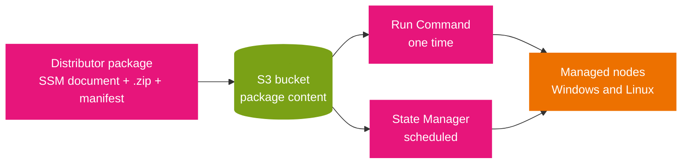

# Distributor

Distributor packages and publishes software to managed nodes. You use it when the software you need is a versioned artifact rather than a one-off command: an agent, a security tool, or an in-house application that has to land on many nodes at a known version. Distributor turns that artifact into a *package*, then Run Command or State Manager installs it.

## What a package is

A Distributor **package** is a collection of installable software plus the instructions to install it. Creating a package creates an SSM document, and the package content lives in Amazon S3.

- **A .zip per target OS platform.** Each `.zip` contains an install script, an uninstall script, and an executable file. Windows Server nodes require PowerShell scripts named `install.ps1` and `uninstall.ps1`; Linux nodes require shell scripts named `install.sh` and `uninstall.sh`. SSM Agent finds and runs the executable.
- **A JSON manifest.** A manifest file describes the package contents. It is not inside the `.zip`; it sits in the same S3 bucket as the `.zip` files and identifies the package and its versions.
- **Multi-platform by design.** One package can carry separate `.zip` files for different operating systems, so a single package publishes to Windows and Linux nodes.

## Where packages come from

- **AWS-provided.** Many AWS agent packages are ready to deploy, for example `AmazonCloudWatchAgent` and `AWSPVDriver`.
- **Third-party.** Vendor packages such as Trend Micro. These are not managed by AWS, so the vendor publishes them and you own the due diligence.
- **Your own.** You build the `.zip` files and manifest for software you write.

## Deploying a package

You target nodes by instance or device ID, AWS account number, tag, or Region, and you choose how the package is installed:

- **One time.** Deploy with Run Command.
- **On a schedule.** Deploy with a State Manager association, which can also install the package when a node first launches.
- **On version change.** Deploy whenever the default package version changes.

Two update modes matter:

- **Reinstall.** Uninstall the current version, then install the new one. The package is unavailable during the swap.
- **In-place update.** Run an update script that replaces the version without uninstalling. The package stays available, which suits security-monitoring agents that must not go down.

The diagram shows the pieces and the two delivery paths. The map on the right is the point: the package artifact is stored once in S3, and both the one-time and scheduled paths install the same versioned artifact.



Read it left to right: the package is authored once and stored in S3, Run Command installs it once, and State Manager installs or re-installs it on a schedule or on launch. Because both paths read the same S3 content, bumping the package version and re-deploying is how you push an update to the fleet.

## Access control and auditing

- **IAM** controls who can create, update, deploy, or delete packages and versions. A common split gives an operator permission to deploy but not to change the package.
- **CloudTrail** and related logging capture Distributor user actions for audit.

## Example

Deploy a package once to nodes in a Region, then keep it current with an association:

```bash
# One-time install of an AWS agent package via Run Command
aws ssm send-command \
  --document-name "AWS-ConfigureAWSPackage" \
  --targets "Key=tag:OS,Values=linux" \
  --parameters 'action=Install,name=AmazonCloudWatchAgent'

# Keep the package installed on a schedule with State Manager
aws ssm create-association \
  --name "AWS-ConfigureAWSPackage" \
  --targets "Key=tag:OS,Values=linux" \
  --parameters 'action=Install,name=AmazonCloudWatchAgent' \
  --schedule-expression "rate(7 days)"
```

## Limits and an exam note

- **Packages per account per Region:** 500; **versions per package:** 25.
- **Package size:** 20 GB maximum; **manifest:** 64 KB; up to 20 attachments of 1 GB each; up to 1,000 files per package.
- **Exam trap:** third-party packages (Trend Micro, for example) are published and maintained by the vendor, not by AWS. The shared responsibility model puts the security of a vendor package on you to validate, so an answer that treats a third-party package as AWS-supported is wrong.

## Sources

- AWS: *AWS Systems Manager Distributor*. https://docs.aws.amazon.com/systems-manager/latest/userguide/distributor.html
- AWS: *Auditing and logging Distributor activity*. https://docs.aws.amazon.com/systems-manager/latest/userguide/distributor-logging-auditing.html
- AWS: *AWS Systems Manager endpoints and quotas*. https://docs.aws.amazon.com/general/latest/gr/ssm.html
