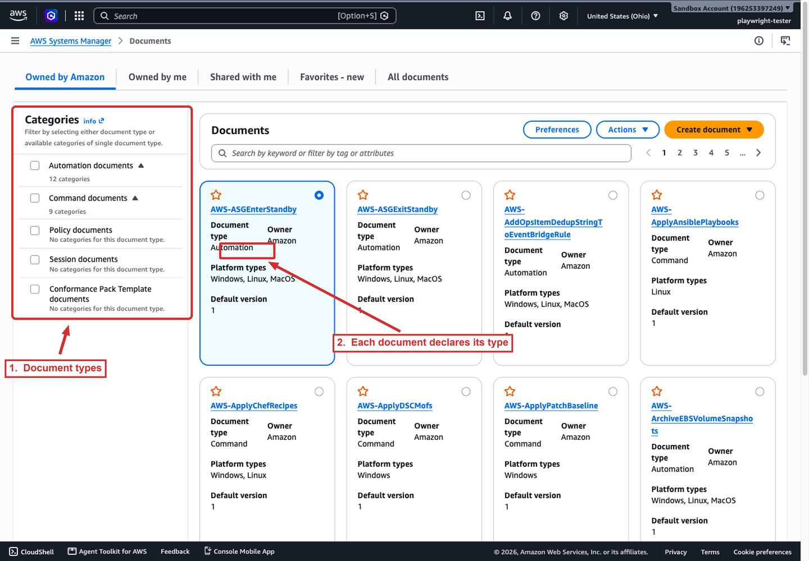
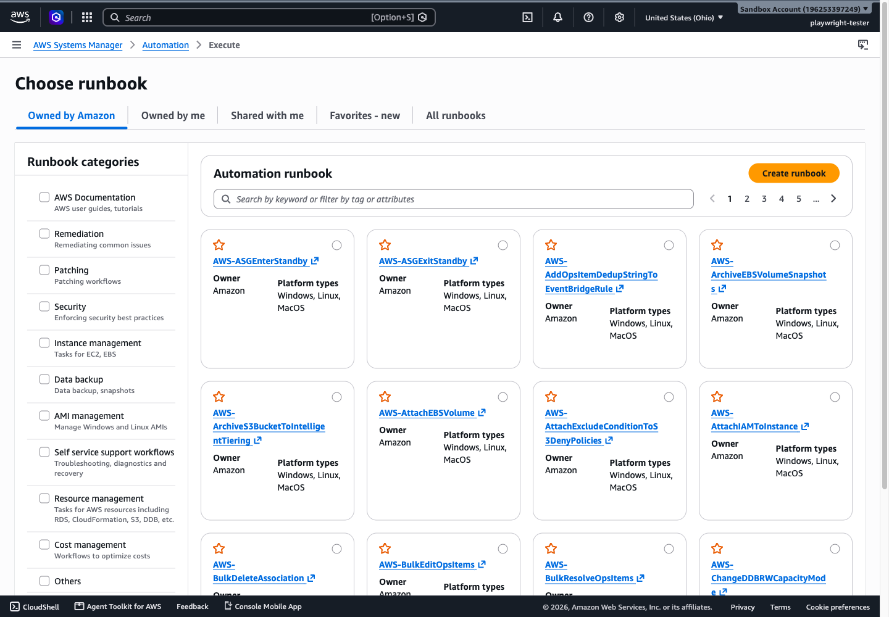
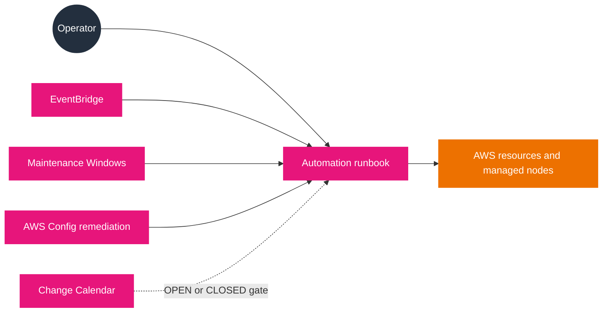

# Change management

The change-management tools decide **what** runs, **when** it runs, and **whether it is allowed to run now**. Documents define the actions; Automation executes multi-step workflows; Maintenance Windows schedule disruptive work in a bounded window; Change Calendar gates whether changes may proceed at all; Quick Setup configures the common set of these for a whole organization in one pass. Together they are the automation half of Systems Manager that the exam tests under Domain 1 (runbooks for remediation) and Domain 3 (automating existing resources).

## Documents

Everything in this document is built on **SSM documents**. A document defines the actions Systems Manager performs, written in JSON or YAML, with steps and parameters.

- **Preconfigured.** Systems Manager ships more than 100 documents owned by Amazon, named with an `AWS-*` prefix (for example `AWS-RunPatchBaseline`, `AWS-UpdateLinuxAmi`). They are public and used by passing runtime parameters.
- **Types.** The type decides which tool can run the document: `Command` (Run Command), `Automation` (runbooks), `Package` (Distributor), `Session` (Session Manager), `ChangeCalendar`, and `ApplicationConfiguration` for AppConfig, among others.
- **Versions.** Every change to content increments the version; you set a default version and can pin a specific version when running.
- **Sharing and tags.** Documents can be public or shared with specific accounts in the same Region, and tagged for access control.
- **Hardening.** Schema version 2.2 supports environment variable interpolation when processing parameters, which helps prevent command injection (requires SSM Agent 3.3.2746.0 or later).

The Documents console lists the documents you can run, filtered by who owns them. The screenshot below is the document list for the sandbox account.



*The Documents console, filtered to Amazon-owned documents. The Categories panel on the left filters by document type (Automation, Command, Policy, Session, and Compliance Pack Template), and each card states its type, owner, platform types, and default version. `AWS-ASGEnterStandby` is an Automation document; `AWS-ApplyChefRecipes` below it is a Command document.*

## Automation

Automation runs **runbooks**, which are SSM documents of type `Automation`. Where Run Command runs one command, a runbook runs a workflow of steps that can act on EC2, RDS, Redshift, S3, and other services, not only nodes.

- **Predefined and custom.** AWS maintains runbooks for common jobs (for example `AWS-UpdateLinuxAmi` to build a golden AMI, or `AWS-UpdateCloudFormationStackWithApproval` to update a stack with approval); you can author your own.
- **Custom logic.** The `aws:executeScript` action runs Python or PowerShell directly from the runbook for logic other actions do not cover.
- **Scale with control.** Rate controls set how many targets run concurrently and how many errors stop the run, so a disruptive change is rolled out safely.
- **Cross-account and cross-Region.** An administrator can run automations across many accounts and Regions from one place.
- **Approvals.** A step can require approval by one or more users before the change proceeds.
- **Cost note.** The Automation free tier changed: customers new to Automation as of August 14, 2025 do not receive it, and the free tier for existing customers ends December 31, 2025.

An Automation execution can be started four ways: manually (console, CLI, or SDK), by an EventBridge event, inside a Maintenance Window, or as AWS Config remediation.

The Automation console exposes the runbooks you can execute, grouped by purpose. The screenshot below is the runbook chooser for the sandbox account.



*The Automation runbook chooser. The Runbook categories on the left include Remediation, Patching, Security, Instance management, Data backup, and AMI management, and the cards are the runbooks themselves (for example `AWS-ASGEnterStandby`). Create runbook is how you author a custom runbook.*

## Maintenance Windows

A **Maintenance Window** defines a schedule for potentially disruptive actions. Each window has a schedule, a maximum duration, registered targets, and registered tasks.

- **Task types.** Run Command commands, Automation workflows, Lambda functions, and Step Functions state machines (Standard workflows only).
- **Targets.** Managed nodes and many other AWS resource types (S3 buckets, SQS queues, KMS keys, and more). Offline nodes can be targeted through an AWS resource group.
- **Scheduling.** Cron and rate expressions, a time zone, and cutoff and date restrictions to bound when work may run.
- **Example uses.** Install or update applications, apply patches, update SSM Agent, build AMIs, or drain a node from a load balancer, patch it, and add it back.

## Change Calendar

**Change Calendar** defines date and time ranges, called *events*, when actions may or may not run. A Change Calendar entry is an SSM document of type `ChangeCalendar` that stores iCalendar 2.0 data.

- **Two modes.** `DEFAULT_OPEN` allows actions except during events; `DEFAULT_CLOSED` blocks actions except during events.
- **What it gates.** Scheduled Automation workflows, Maintenance Windows, and State Manager associations can be added to a calendar, so the calendar can block or permit them.
- **Import.** Events can be imported from a `.ics` file exported from Google Calendar, Microsoft Outlook, or iCloud Calendar.
- **Querying.** The `GetCalendarState` API returns the current state, the state at a given time, or the next change; it has a quota of 10 requests per second.

The diagram shows the four ways an Automation runbook starts and how Change Calendar gates them. The gate is the point: even a correctly configured trigger will not proceed when the calendar says the account is closed.



Read the solid arrows as triggers and the dashed arrow as a gate. Any of the four triggers can start a runbook, but a Change Calendar in the `CLOSED` state stops it. That separation matters in scenarios: the trigger answers "what started it", and the calendar answers "was it allowed to start".

## Quick Setup

Quick Setup configures the common set of the above in one guided pass, and it is the recommended way to set up patching and host management across an organization.

- **Scope.** An entire organization in AWS Organizations, selected accounts and Regions, or a single account.
- **Host Management** configures, among other options: updating SSM Agent every two weeks, collecting Inventory every 30 minutes, patch scanning, and the CloudWatch agent.
- **Patch policy** (the recommended patching method) defines patching for all accounts in all Regions, selected accounts and Regions, or one account-Region pair.
- **Least privilege.** Quick Setup creates the required IAM roles for the options you choose.

## State Manager or Maintenance Windows

Both State Manager associations and Maintenance Windows can apply updates. The distinction is the trigger pressure:

- Use **State Manager** to enforce ongoing compliance, such as keeping antivirus installed or a port closed.
- Use **Maintenance Windows** to perform high-priority, time-sensitive work inside a period you specify, such as patching a fleet on patch Tuesday.

## Examples

Start a runbook that patches Linux instances, and create a maintenance window that runs it weekly:

```bash
# Start a predefined Automation runbook (patch Linux instances) with rate control
aws ssm start-automation-execution \
  --document-name "AWS-RunPatchBaseline" \
  --parameters 'Operation=Install' \
  --max-concurrency "10%" --max-errors "1"

# Create a weekly maintenance window; then register targets and a task inside it
aws ssm create-maintenance-window \
  --name "weekly-patching" \
  --schedule "cron(0 3 ? * SUN *)" \
  --duration 3 --cutoff 1 \
  --allow-unassociated-targets
```

## Sources

- AWS: *AWS Systems Manager Documents*. https://docs.aws.amazon.com/systems-manager/latest/userguide/documents.html
- AWS: *AWS Systems Manager Automation*. https://docs.aws.amazon.com/systems-manager/latest/userguide/systems-manager-automation.html
- AWS: *AWS Systems Manager Maintenance Windows*. https://docs.aws.amazon.com/systems-manager/latest/userguide/maintenance-windows.html
- AWS: *AWS Systems Manager Change Calendar*. https://docs.aws.amazon.com/systems-manager/latest/userguide/systems-manager-change-calendar.html
- AWS: *Set up Amazon EC2 host management using Quick Setup*. https://docs.aws.amazon.com/systems-manager/latest/userguide/quick-setup-host-management.html
