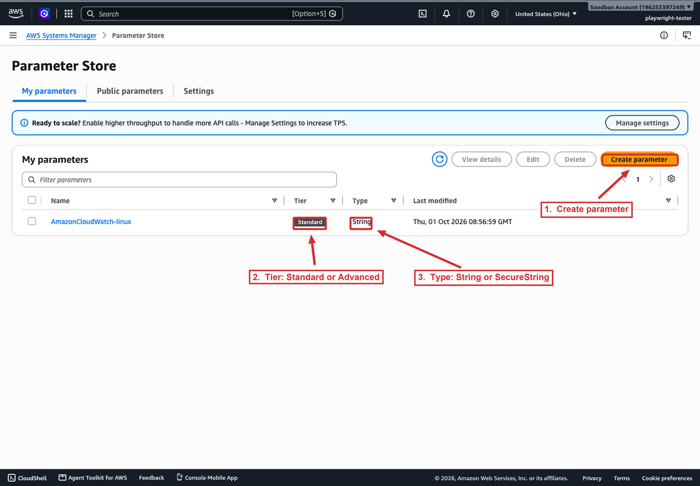
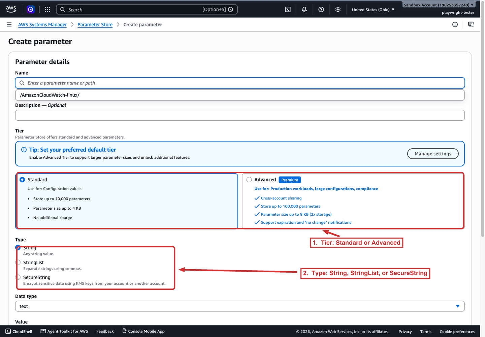
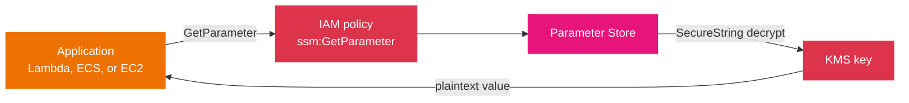

# Parameter Store

Parameter Store is a centralized store for named values, called *parameters*: a block of text, a list, an AMI ID, a license key, an endpoint URL, or a password. It lets an application read configuration at runtime instead of hard-coding it, and it lets you change that configuration without a redeploy. It is the configuration side of Systems Manager, distinct from the node-action tools and from AppConfig's validated rollouts.

## Parameter types

- **`String`.** Plain text: environment names, endpoint URLs, resource identifiers.
- **`StringList`.** A comma-separated list of plain-text values, for example `subnet-123abc,subnet-456def,subnet-789ghi`.
- **`SecureString`.** A value encrypted with AWS KMS. Use it for configuration that must be encrypted, such as service endpoints and account identifiers.

For credentials, database passwords, API keys, and tokens, AWS recommends **Secrets Manager** rather than a `SecureString` parameter. Secrets Manager adds automatic rotation and cross-Region replication that Parameter Store does not. The distinction is a common scenario: configuration goes in Parameter Store, *rotating secrets* go in Secrets Manager.

The console lists each parameter with its name, tier, and type, which is how you audit the mix across an account. The screenshot below is the Parameter Store list for the sandbox account.



*The Parameter Store parameter list. The Tier column shows Standard or Advanced and the Type column shows String, StringList, or SecureString; the Create parameter button opens the form that sets both. The one parameter shown (`AmazonCloudWatch-linux`) is a Standard String parameter.*

## Features

- **Hierarchical naming.** Group parameters under a path, for example `/dev/webserver/linux/approved-ami`. You can then fetch a whole branch (`/dev/webserver`) or a leaf, and IAM can grant access by prefix.
- **Versioning.** Parameter Store keeps the **100 most recent versions** of each parameter, so you can reconstruct a previous value when investigating an incident.
- **IAM control.** Policies decide who may read, write, list, or delete a parameter, and who may decrypt a `SecureString` (via `kms:Decrypt`). A role can be allowed `/myapp/prod/*` but not `/myapp/dev/*`.
- **Updates are immediate.** Changing a parameter takes effect on the next read, with no validation, gradual rollout, or automatic revert. When a bad value could cause an outage, AppConfig adds validation and rollback.
- **Throughput mode.** The default throughput suits lower-scale workloads; a high-throughput mode raises the request rate for an additional cost. Throughput is separate from the parameter tier.
- **Integrations.** Lambda can fetch parameters with the Parameters and Secrets Lambda Extension; ECS and Fargate inject parameters as environment variables (resolved at task start); CloudFormation can reference parameters; EventBridge can notify on changes.

## Parameter tiers

Each parameter belongs to a tier, configured per account and Region. The tier sets the parameter count, value size, policy support, shareability, and cost.

| Feature | Standard | Advanced |
|---------|----------|----------|
| Use case | Most configuration, low scale (default) | Higher limits, larger values, or policies |
| Maximum parameters (per account and Region) | 10,000 | 100,000 |
| Maximum value size | 4 KB | 8 KB |
| Parameter policies | Not supported | Supported |
| Shareable across AWS accounts | Not supported | Supported |
| Tier change | Upgradeable to Advanced | Not downgradeable |
| Cost | No additional charge | Charges apply |

Three operational points matter:

- **Default tier setting.** The account-Region default can be `Standard`, `Advanced`, or `Intelligent-Tiering`. Changing the default affects only new parameters that do not specify a tier; existing parameters are untouched.
- **One-way tier change.** A Standard parameter can be upgraded to Advanced at any time, but an Advanced parameter **cannot** be downgraded to Standard. Downgrading would truncate an 8 KB value to 4 KB, delete any attached policies, and change the encryption form. To stop paying for an Advanced parameter, delete it and recreate it as Standard.
- **Pricing mechanism.** Advanced parameters are billed per parameter per month (commonly quoted at about $0.05 per advanced parameter per month) plus per API interaction; verify the current figure on the AWS Systems Manager pricing page rather than relying on the number.

The Create parameter form makes the tier choice explicit by listing what each tier allows. The screenshot below shows the two tier cards and the three parameter types on that form.



*The Create parameter form. The Standard card lists 10,000 parameters, 4 KB values, and no additional charge; the Advanced card lists cross-account sharing, 100,000 parameters, 8 KB values, and expiration and no-change notifications. The Type section below chooses String, StringList, or SecureString, which is also where a value becomes encrypted.*

## Parameter policies

Parameter policies are available only on **advanced** parameters. They attach rules to a parameter, and a parameter can carry more than one.

- **Expiration (TTL).** Assign an expiration date so a parameter, such as a temporary password, is deleted automatically. This enforces rotation or cleanup of sensitive data rather than relying on a human to remember.
- **Expiration notification.** Emit an EventBridge event a set number of days before a parameter expires.
- **No-change notification.** Emit an EventBridge event when a parameter has not changed for a set number of days, so stale configuration is visible.

The diagram shows how a value is retrieved and, for a `SecureString`, decrypted. The two authorization decisions are the point: IAM must allow the read, and IAM must allow the KMS decrypt.



Read it left to right: the application calls Parameter Store, which checks the IAM policy for the read, and for a `SecureString` also asks KMS to decrypt. A read that fails with `AccessDenied` is usually the missing `ssm:GetParameter`; a read that fails to decrypt is usually the missing `kms:Decrypt`. Separating those two failures is what makes this a fast diagnosis.

## Examples

Store a plain configuration value, a `StringList`, and an encrypted secret; then read the secret back decrypted:

```bash
# Plain configuration under a hierarchy
aws ssm put-parameter --name "/myapp/prod/db-url" \
  --value "db.internal.example.com" --type String

# Encrypted value using the default KMS key
aws ssm put-parameter --name "/myapp/prod/db-password" \
  --value "correct-horse-battery-staple" --type SecureString

# Retrieve the SecureString with decryption
aws ssm get-parameter --name "/myapp/prod/db-password" --with-decryption

# Retrieve every parameter under a path
aws ssm get-parameters-by-path --path "/myapp/prod"
```

An advanced parameter with a seven-day time to live, so it is deleted automatically:

```bash
aws ssm put-parameter --name "/myapp/prod/temp-token" \
  --value "abc123" --type SecureString --tier Advanced \
  --policies '[{"Type":"Expiration","Version":"1.0","Attributes":{"Timestamp":"2026-11-01T00:00:00Z"}}]'
```

## Sources

- AWS: *AWS Systems Manager Parameter Store*. https://docs.aws.amazon.com/systems-manager/latest/userguide/systems-manager-parameter-store.html
- AWS: *Choosing parameter tiers in Parameter Store*. https://docs.aws.amazon.com/systems-manager/latest/userguide/parameter-store-advanced-parameters.html
- AWS: *Assigning parameter policies in Parameter Store*. https://docs.aws.amazon.com/systems-manager/latest/userguide/parameter-store-policies.html
- AWS: *AWS Systems Manager pricing*. https://aws.amazon.com/systems-manager/pricing/
