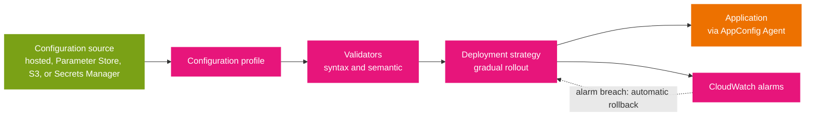

# Application tools

Two Systems Manager tools operate on an *application* rather than a single node or resource. Application Manager gathers operational information about an application's resources into one view; AppConfig safely changes application behavior at runtime. One caveat up front: Application Manager is no longer open to new customers, so treat it as a conceptual and exam-awareness topic rather than something you will provision.

## Application Manager

Application Manager helps you investigate and remediate issues in the context of an application or cluster. An *application* is a logical group of AWS resources you operate as a unit, and Application Manager aggregates operational information from several services into one place.

- **What it imports.** CloudFormation stacks, AppRegistry applications, AWS Launch Wizard applications, Amazon ECS and EKS clusters, and custom applications.
- **What it shows, per application.** EC2 instance state, status, and Auto Scaling health; CloudWatch alarms; compliance from AWS Config and State Manager; EKS cluster information; CloudTrail and CloudWatch Logs data; OpsItems from OpsCenter; and host-service resource details.
- **Remediation.** It surfaces runbooks you can associate with the application to fix common issues.
- **Availability change.** Application Manager is closed to new customers. The exam may still name it, but the practical replacement is to use OpsCenter plus Resource Groups and the underlying services directly.

## AppConfig

AWS AppConfig safely changes application behavior in production **without redeploying code**, using feature flags and free-form configuration. Where Parameter Store simply serves a value, AppConfig governs *how a change is rolled out and whether it is safe*.

- **Use cases.** Feature flags and toggles, gradual releases, A/B experimentation, runtime tuning (log levels, throttling limits), and allow-block lists.
- **Configuration sources.** AppConfig can deploy configuration from its own hosted store, or from Secrets Manager, Parameter Store, or Amazon S3. This is why it pairs with Parameter Store rather than replacing it.
- **Safety controls.** *Validators* check that configuration is syntactically and semantically correct before deployment; *deployment strategies* roll a change out gradually; and *monitoring with automatic rollback* watches CloudWatch alarms and reverts the change if an alarm fires.
- **Security and audit.** IAM for fine-grained access control, KMS for encryption, CloudTrail for auditing.
- **Agent.** The AWS AppConfig Agent runs alongside the application (EC2, Lambda, ECS, EKS) to serve the latest values.

The diagram shows the safety pipeline that distinguishes AppConfig from a plain key-value store. The rollback arrow is the point: a bad configuration is detected by a CloudWatch alarm and reverted automatically.



Read it left to right: the value comes from a source, is validated, and is deployed gradually while CloudWatch watches the application. If an alarm fires, AppConfig rolls the configuration back without a code deployment. That is the capability a scenario is testing when it contrasts "store a value" with "safely roll out a change".

## Choosing between the three

| Need | Tool |
|------|------|
| Static configuration or lightweight secrets, read at runtime | Parameter Store (see [07-parameter-store.md](07-parameter-store.md)) |
| Rotating credentials with automatic rotation | Secrets Manager |
| Feature flags and runtime changes with validation and rollback | AppConfig |

## Limits and an exam note

- **Applications per Region:** 100 by default; 20 environments and 100 configuration profiles per application; 20 deployment strategies per Region.
- **Data plane throughput:** `GetLatestConfiguration` serves 1,000 requests per second; without the AppConfig Agent a client is limited to about 1 million configurations received per day (burst).
- **Exam trap:** calling the AppConfig data plane directly for every read will hit the daily retrieval limit. The AWS AppConfig Agent caches configuration locally, which is why "use the AppConfig Agent" is the answer when a scenario needs frequent reads without throttling.

## Example

Create an application, an environment, and a configuration profile, then start a deployment:

```bash
# Create the application; the response returns the application ID
aws appconfig create-application --name storefront

# Create an environment (prod) and a hosted configuration profile
aws appconfig create-environment \
  --application-id "$APP_ID" --name prod
aws appconfig create-configuration-profile \
  --application-id "$APP_ID" --name checkout-flags \
  --location-uri hosted --type AWS.AppConfig.FeatureFlags

# Deploy version 1 of the profile using a deployment strategy
aws appconfig start-deployment \
  --application-id "$APP_ID" --environment-id "$ENV_ID" \
  --deployment-strategy-id "$STRATEGY_ID" \
  --configuration-profile-id "$PROFILE_ID" --configuration-version 1
```

## Sources

- AWS: *AWS Systems Manager Application Manager*. https://docs.aws.amazon.com/systems-manager/latest/userguide/application-manager.html
- AWS: *What is AWS AppConfig?*. https://docs.aws.amazon.com/appconfig/latest/userguide/what-is-appconfig.html
- AWS: *AWS Systems Manager Application Manager availability change*. https://docs.aws.amazon.com/systems-manager/latest/userguide/application-manager-availability-change.html
