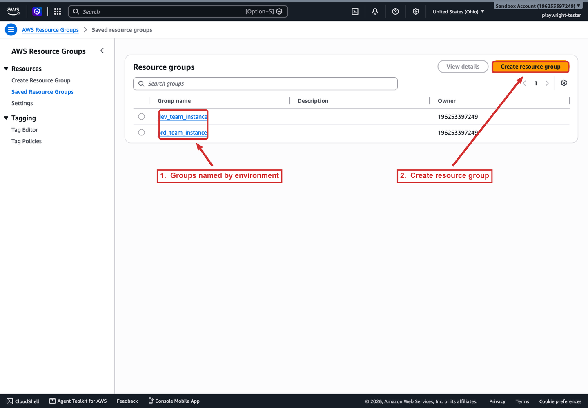

# Resource Groups

AWS Resource Groups organizes AWS resources into logical collections so you can act on many resources at once rather than moving service by service. It is not part of Systems Manager itself, but Systems Manager leans on it: a resource group is a common way to target Run Command, State Manager associations, Maintenance Windows, and Application Manager views. Understanding resource groups is what lets you target "a layer of an application" instead of listing instance IDs.

## What a resource group is

A **resource group** is a collection of AWS resources in **one AWS Region** that match a query. The group is defined by the query, not by a static list, so resources that match the criteria are members automatically.

- **Tag-based query.** Membership is based on a list of resource types and tags. This is the flexible form: tag instances with `Environment=prod` and `Layer=web`, and a group can select exactly those.
- **CloudFormation stack-based query.** Membership is based on the resources in one CloudFormation stack, optionally restricted to specific resource types within the stack.
- **Regional.** A resource group is scoped to a single Region, and its resources are declared as `AWS::service::resource`.
- **Nestable.** A group can contain other groups in the same Region, so you can build a hierarchy.
- **Service-linked.** Some services create and manage their own resource groups, which you cannot fully edit in the Resource Groups console.

## Why it matters for Systems Manager

Resource groups turn tag conventions into reusable targets:

- **Run Command and State Manager** can target a resource group instead of enumerating nodes.
- **Maintenance Windows** can target a resource group, which is how you reach nodes that are offline at the time the window is defined.
- **Application Manager** imports resources grouped by CloudFormation stacks, AppRegistry, and clusters.
- **Explorer and OpsCenter** can group and filter operational data by the tag keys you nominate (Explorer lets you set up to five reporting tag keys).

The practical rule: define your tag schema first (for example `Environment`, `Layer`, `PatchGroup`), then build resource groups on top of it, then target Systems Manager operations at the group. Changing the tag membership changes the target set with no document edits.

The Resource Groups console lists the groups in the current Region. The screenshot below shows two groups in the sandbox account, named by environment.



*The Resource Groups console. The two groups, `dev_team_instance` and `prd_team_instance`, are named by environment and owned by the account; Create resource group starts a new one. Both sit in the same Region, which is the scope a resource group is limited to.*

## Example

Create a tag-based group for production web servers and list its members:

```bash
# Group production web-tier instances by tags
aws resource-groups create-group \
  --name prod-web \
  --resource-query '{"Type":"TAG_FILTERS_1_0","Query":"{\"ResourceTypeFilters\":[\"AWS::EC2::Instance\"],\"TagFilters\":[{\"Key\":\"Environment\",\"Values\":[\"prod\"]},{\"Key\":\"Layer\",\"Values\":[\"web\"]}]}"}'

# List the resources currently in the group
aws resource-groups list-group-resources --group-name prod-web
```

## Limits and an exam note

- **Resource groups per account per Region:** 100 by default (adjustable).
- **Tags per resource:** 50 user-created tags; a tag key is 1 to 128 characters, and keys beginning with `aws:` are reserved.
- **Regional, always.** A resource group cannot span Regions, so a fleet that runs in three Regions needs three groups even when the tag values are identical. A scenario that expects one group to cover every Region is testing exactly this.

## Sources

- AWS: *What are resource groups?*. https://docs.aws.amazon.com/ARG/latest/userguide/resource-groups.html
- AWS: *AWS services that work with AWS Resource Groups*. https://docs.aws.amazon.com/ARG/latest/userguide/integrated-services-list.html
- AWS: *AWS Resource Groups and Tagging endpoints and quotas*. https://docs.aws.amazon.com/general/latest/gr/arg.html
