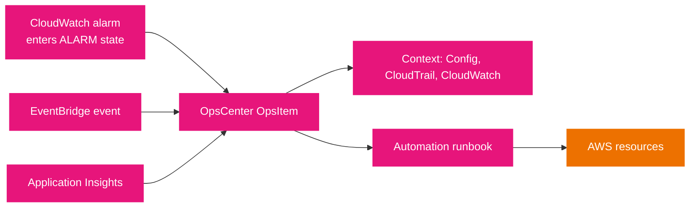

# Operations tools

Explorer and OpsCenter turn the operational data Systems Manager already collects into something an operator can act on. Explorer is the dashboard that aggregates and visualizes that data; OpsCenter is the work queue of issues that need investigation and remediation, each tied to a runbook. Both are the tools a scenario points to when the answer is "see the problem and fix it in one place".

## Explorer

Explorer is a customizable operations dashboard that reports on your AWS resources and aggregates *OpsData* across accounts and Regions.

- **What it shows.** Metadata about managed nodes; patch compliance from Patch Manager; association compliance from State Manager; and data from supporting services such as AWS Config, Trusted Advisor, Compute Optimizer, and AWS Support (support cases).
- **Widgets.** *Informational widgets* summarize state (instance count, instances by AMI, total noncompliant nodes, support cases). *OpsItem widgets* summarize the work queue (open OpsItem summary, OpsItems by status, OpsItems over time).
- **Filters and grouping.** Every widget can filter by account, Region, and tag, and some widgets group data by those dimensions.
- **Reporting tag keys.** You can nominate up to five tag keys when you set up Explorer; a key that matches a resource generating an OpsItem is carried into that OpsItem.
- **Display modes.** Single-account/single-Region (default), single-account/multiple-Region (via a resource data sync), and multiple-account/multiple-Region (requires AWS Organizations with All features, aggregating into the management account).
- **Deprecation.** The Explorer page is deprecated as of December 31, 2026; resource data sync moves to OpsCenter, and the operational data stays available through the API and the source service consoles.

## OpsCenter

OpsCenter is a central place to view, investigate, and resolve operational work items, called **OpsItems**, related to AWS resources. Its goal is to reduce mean time to resolution by removing the need to hop between consoles.

- **OpsItems.** Each OpsItem is an operational issue or interruption tied to one or more AWS resources, with a status, a source, and searchable custom data.
- **Automatic creation.** CloudWatch can create an OpsItem when an alarm enters the `ALARM` state, and EventBridge can create one from an event published by any AWS service. OpsItems can also be created manually.
- **Typical triggers.** A CloudWatch alarm on DynamoDB read-write thresholds, EC2 CPU utilization, billing estimated charges, an EC2 status check failure, or EBS disk space; or an EventBridge event from Security Hub CSPM, a DynamoDB throttling event, an Auto Scaling launch failure, a Systems Manager Automation failure, an AWS Health maintenance alert, or an EC2 state change.
- **Context.** Each OpsItem aggregates the resource name and ID, alarm or event details, alarm history and timeline, and data from AWS Config, CloudTrail, and CloudWatch, so the investigation happens in one page.
- **Deduplication.** Specifying related resource ARNs lets OpsCenter use built-in logic to avoid duplicate OpsItems for the same resource.
- **Remediation.** OpsItems offer recommended Systems Manager Automation runbooks to resolve the issue.
- **Integrations and reach.** CloudWatch Application Insights for .NET and SQL Server can create OpsItems, Security Hub CSPM findings can be aggregated, and the public API lets you integrate OpsCenter with existing case-management systems. It works for EC2 instances and on-premises/hybrid managed nodes.

The diagram shows how an issue becomes an OpsItem and then a fix. The single funnel is the point: alarms, events, and application insights all land in one queue with context, and a runbook resolves them.



Read it left to right: a signal becomes an OpsItem, OpsCenter attaches investigation context from Config, CloudTrail, and CloudWatch, and the operator runs an Automation runbook against the resource. This is the Domain 1 remediation pattern: detect with monitoring, centralize with OpsCenter, remediate with Automation.

## Explorer and OpsCenter together

Explorer is the *view*; OpsCenter is the *queue*. Explorer visualizes OpsItems by account, Region, and tag to show where issues concentrate, and links into OpsCenter when an item needs action. A common exam phrasing that points here is "reduce mean time to resolution by viewing, investigating, and remediating issues in one place", which is OpsCenter.

## Example

Create an OpsItem manually and list the open queue:

```bash
# Raise an OpsItem with searchable context
aws ssm create-ops-item \
  --title "High CPU on the web fleet" \
  --source "Custom" \
  --priority 2 \
  --operational-data '{"Environment":{"Value":"prod","Type":"SearchableString"}}'

# List open OpsItems
aws ssm describe-ops-items --filters Key=Status,Values=Open
```

## Sources

- AWS: *AWS Systems Manager Explorer*. https://docs.aws.amazon.com/systems-manager/latest/userguide/Explorer.html
- AWS: *AWS Systems Manager OpsCenter*. https://docs.aws.amazon.com/systems-manager/latest/userguide/OpsCenter.html
