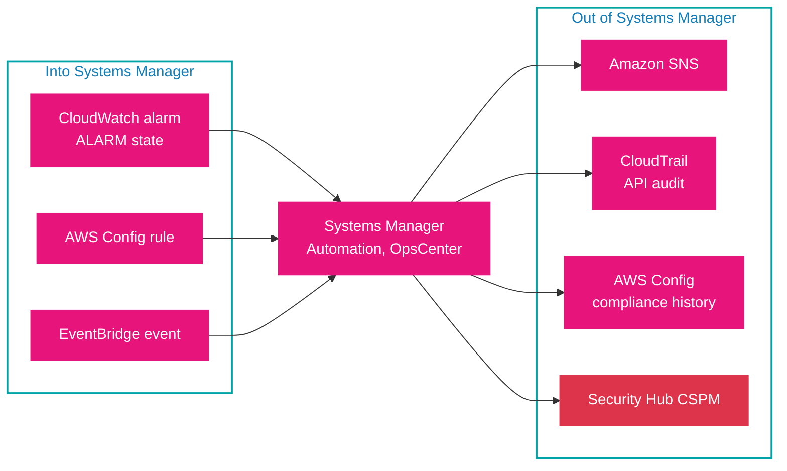

# Monitoring and integration

Systems Manager does not operate in isolation. It reads and writes state through CloudWatch, CloudTrail, AWS Config, EventBridge, and Security Hub, and it aggregates operational data across accounts and Regions. This document maps those integrations so you can answer "where does this data come from" and "how do I see it across the organization".

## CloudWatch

- **Agent and session logs.** SSM Agent logs and Session Manager session logs can be sent to CloudWatch Logs (with optional KMS encryption), alongside S3 and CloudTrail destinations.
- **Dashboards.** CloudWatch dashboards can display Systems Manager data and the metrics of the resources SSM acts on, so a single dashboard shows both the automation and its effect.
- **Application Insights.** CloudWatch Application Insights for .NET and SQL Server can create OpsItems for detected application problems.

## CloudTrail

CloudTrail records Systems Manager API calls, giving an audit trail of who started a session, ran a command, changed a parameter, or executed a runbook, and from where. Session start and stop are visible here as API activity, and Distributor and Automation actions are attributable to an IAM principal.

## AWS Config

- **Compliance history.** Config records compliance history and change tracking for Patch Manager patching data and State Manager associations.
- **Remediation.** An AWS Config rule can trigger a Systems Manager Automation runbook as remediation, which closes the loop from detection to fix without a human in the middle.
- **Managed-instance inventory.** Config can record software inventory for managed instances when longer-than-30-day retention is required.

## EventBridge

Every Systems Manager tool that emits events does so through EventBridge, and several tools are also EventBridge *targets*. The important event flows:

- **Send an event into SSM.** A CloudWatch alarm in `ALARM` state or any service's event can create an OpsItem, or start an Automation execution.
- **React to an SSM event.** An association failure, a Run Command completion, a patch operation, a session start, or a parameter change can drive an EventBridge rule that notifies SNS or starts another action.
- **Schedule.** EventBridge schedules can trigger Automation directly.

The diagram shows the two directions: services feeding SSM, and SSM emitting to other services. The distinction matters, because "event-driven automation" (Domain 3, Skill 3.2.2) is the left-to-right direction.



Read the left block as detection sources and the right block as destinations. An alarm or a Config rule drives a runbook (left to center), and a completed runbook, patch result, or session produces an event, a CloudTrail record, or a compliance finding (center to right). This is the shape of the Domain 1 remediation questions.

## Cross-account and cross-Region

- **Resource data sync** aggregates Inventory and Compliance data into one S3 bucket for Athena queries, and aggregates Explorer OpsData across Regions.
- **AWS Organizations** lets a single patch policy or Quick Setup configuration span accounts and Regions.
- **Explorer's multiple-account/multiple-Region mode** requires Organizations with All features, aggregating account data into the management account.

## Example

An EventBridge rule that reacts to a failed Systems Manager Automation execution, here to notify an SNS topic:

```json
{
  "source": ["aws.ssm"],
  "detail-type": ["Automation Execution Status-change Notification"],
  "detail": { "status": ["Failed"] }
}
```

This is the "out of Systems Manager" direction: the runbook failed, Systems Manager emitted the event, and EventBridge routed it to SNS. An alarm-driven rule runs the other way, using `"source": ["aws.cloudwatch"]` with the `CloudWatch Alarm State Change` detail type, and can start a runbook when an alarm enters the `ALARM` state.

## Sources

- AWS: *Logging and monitoring in AWS Systems Manager*. https://docs.aws.amazon.com/systems-manager/latest/userguide/monitoring.html
- AWS: *Monitoring Systems Manager events with Amazon EventBridge*. https://docs.aws.amazon.com/systems-manager/latest/userguide/monitoring-eventbridge-events.html
- AWS: *Logging AWS Systems Manager API calls with AWS CloudTrail*. https://docs.aws.amazon.com/systems-manager/latest/userguide/monitoring-cloudtrail-logs.html
