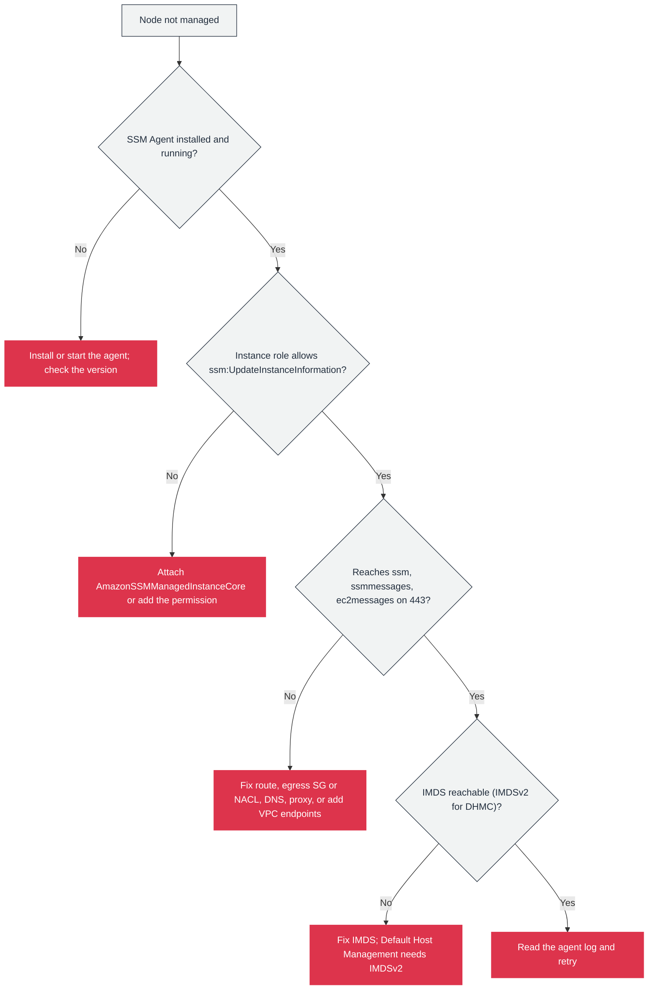

# Troubleshooting Systems Manager

Most Systems Manager failures are the same failure: a node that should be managed is not, or is not reachable for a command, session, or patch. The work is to isolate which of four layers is broken, in order: the **agent**, the **IAM role**, the **network path**, and **instance metadata**. Work them top to bottom rather than guessing.

## Symptom: a node is not managed (or disappeared)

Check the layers in this order.

1. **Agent.** Is SSM Agent installed and running? Confirm the version with `aws ssm describe-instance-information` or on the node. If it was never installed (a non-AWS AMI), install it. If it is stopped, start it. Some capabilities have minimum versions (Session Manager needs 2.3.68.0 or later; Default Host Management Configuration needs 3.2.582.0 or later).
2. **IAM role.** The instance needs a role that allows `ssm:UpdateInstanceInformation`. `AmazonSSMManagedInstanceCore` provides it. A custom policy that omits it leaves the node unregistered even though the agent runs.
3. **Network path.** The agent connects outbound over HTTPS (TCP 443) to `ssm.*`, `ssmmessages.*`, and `ec2messages.*`. A private subnet with no NAT route and no VPC endpoints cannot reach them. Check route tables, egress security-group and NACL rules, DNS resolution, and any HTTP proxy.
4. **Instance metadata.** The agent uses IMDS. Default Host Management Configuration requires IMDSv2 specifically and does not support IMDSv1.

If all four are correct, read the agent log (`/var/log/amazon/ssm/` on Linux, `C:\ProgramData\Amazon\SSM\Logs` on Windows), which usually names the failing call.



The flow is a decision tree rather than a checklist on purpose: the first "no" is the cause, so you stop there. In practice the role and the network path are the most common answers, because the agent is preinstalled on AWS AMIs and is usually present.

## Symptom: Run Command does not execute

- Confirm the node is **managed and Online** (`PingStatus: Online`). Run Command cannot reach a node that is not registered.
- Confirm the document exists and is shared with the account, and that its type is `Command`.
- Confirm the **instance role** allows the actions the document performs. A node can be managed and still fail a command whose actions its role does not permit.
- Check `AgentVersion`. Very old agents can fail documents that rely on newer features.
- Remember Run Command is **eventually consistent**: a command issued immediately after another may not yet see its effect.

## Symptom: Session Manager cannot connect

- Agent version 2.3.68.0 or later.
- The **caller** needs `ssm:StartSession`; the **instance role** needs the `ssmmessages` permissions.
- The node must reach the `ssmmessages` endpoint (NAT or a VPC interface endpoint).
- For the CLI, the **Session Manager plugin** must be installed locally.
- Expect no session logging for **port-forwarding or SSH** sessions; only interactive shell sessions are logged.

## Symptom: patching fails or a node is non-compliant

- The node has **no patch group tag**, so it resolves to no baseline. Add `Patch Group` (or `PatchGroup`) and register the group with a baseline.
- The tag key is misspelled or has the wrong case; the key is case-sensitive.
- A patch group is already registered to a different baseline. A group registers with only one baseline.
- The node cannot reach the patch repositories (no internet or no NAT), so the install cannot download.
- The baseline's approval rules do not approve the missing patches, which is a rule problem, not a connectivity problem.

## The decisive rule

A node that is not managed is a **foundation** problem (agent, role, network, IMDS), and no Systems Manager tool works until it is fixed. A node that is managed but fails one operation is a **tool** problem (permissions for the document, a missing tag, a baseline rule). Separating those two categories is what makes Systems Manager troubleshooting fast.

## Example

The first command to run when a node is missing from Systems Manager: list the registered nodes and their status, then read the agent log on the node that is absent.

```bash
# Registered nodes, ping status, and agent version
aws ssm describe-instance-information \
  --query 'InstanceInformationList[].[InstanceId,PingStatus,AgentVersion]' --output table
```

A node missing from this list was never managed (agent, role, or network). A node present with `ConnectionLost` registered before but is not reaching the service now.

## Sources

- AWS: *Troubleshooting SSM Agent*. https://docs.aws.amazon.com/systems-manager/latest/userguide/troubleshooting-ssm-agent.html
- AWS: *Troubleshooting Systems Manager Run Command*. https://docs.aws.amazon.com/systems-manager/latest/userguide/troubleshooting-remote-commands.html
- AWS: *Step 1: Complete Session Manager prerequisites*. https://docs.aws.amazon.com/systems-manager/latest/userguide/session-manager-prerequisites.html
