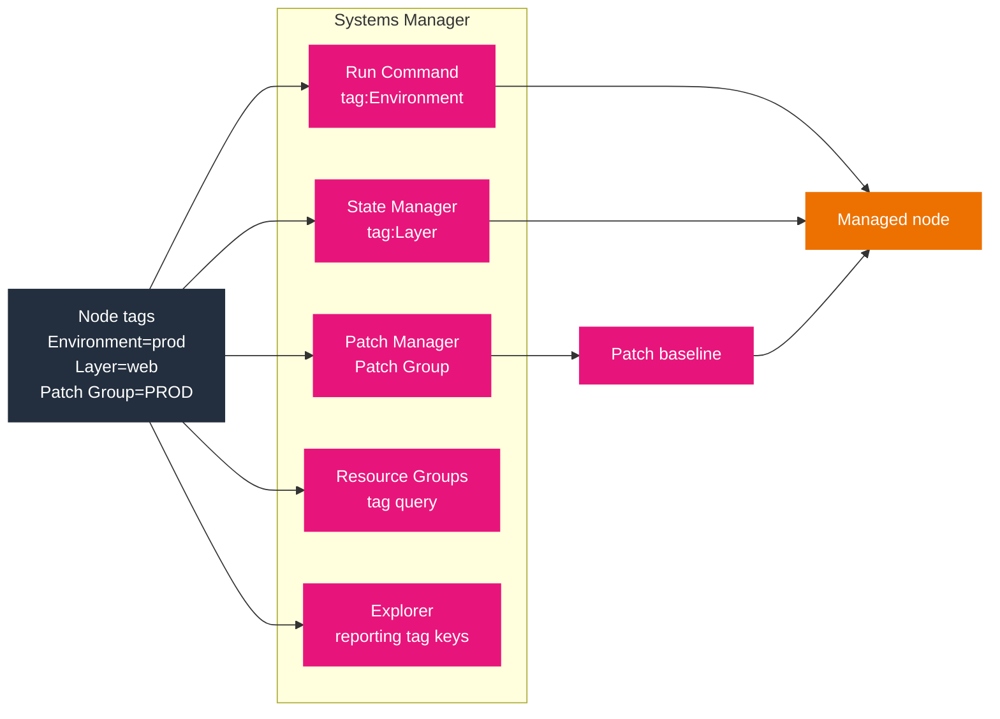

# Tagging and tag-based targeting

Tags are how Systems Manager decides *which* nodes and resources an operation acts on. Almost every scenario that says "target the production web tier" or "patch only the staging hosts" is really a question about tags: the tag is the selector, and the Systems Manager API is the action. This document covers the tag model itself, the `tag:` targeting syntax, the special `Patch Group` key, the Systems Manager resources that accept tags, and the integration points where tags change behavior.

## The tag model

A tag is a key and an optional value, both strings. Neither has meaning to AWS; Systems Manager treats a tag as a literal string for matching. That has one consequence worth stating up front: **keys and values are case-sensitive**, so `Environment` and `environment` are two different keys, and `prod` and `PROD` are two different values.

- **Key length:** 1 to 128 Unicode characters. Keys beginning with `aws:` are reserved for AWS and cannot be applied by you.
- **Value length:** up to 256 Unicode characters. A value is optional but most targeting uses one.
- **Tags per resource:** 50, except **Automations, which allow 5**.
- **No PII.** AWS explicitly warns against putting personally identifiable information in a tag value.

Tags are applied at resource creation (the `…Create…` APIs accept a `Tags` parameter) or afterward with `AddTagsToResource`. The `ResourceType` for that call is one of a fixed set.

## Taggable Systems Manager resources

`AddTagsToResource` accepts these resource types, and each has its own ID format:

| Resource type | ID example | Notes |
|---------------|-----------|-------|
| `Document` | `MyRunbook` | Use the name; for a shared document, use its full ARN |
| `Parameter` | `/myapp/prod/db-url` | The parameter name |
| `MaintenanceWindow` | `mw-012345abcde` | |
| `PatchBaseline` | `pb-012345abcde` | |
| `Automation` | `example-c160-4567-8519-012345abcde` | Automation executions, max 5 tags |
| `Association` | `1234abcd-...` | State Manager associations |
| `OpsItem` | `oi-012345abcde` | |
| `OpsMetadata` | `aws/ssm/MyGroup/appmanager` | Derived from the ARN after the word `opsmetadata` |
| `ManagedInstance` | `mi-012345abcde` | **On-premises nodes only**, not EC2 |
| `CloudConnector` | `b0d1e2f3-...` | Connections to other clouds |

The `ManagedInstance` row is a common exam trap. On EC2, an instance's tags are **EC2 tags**, managed through the EC2 API and the EC2 console. The SSM `ManagedInstance` resource type exists for hybrid nodes registered with an `mi-` prefix, where there is no EC2 tag store to use.

## Tag-based targeting

Systems Manager `targets` select nodes by instance ID, by a filter, or by tag. A tag target uses the form `Key=tag:<KeyName>,Values=<value>`.

```bash
# Run a command on nodes tagged Environment = prod
aws ssm send-command \
  --document-name "AWS-RunShellScript" \
  --targets "Key=tag:Environment,Values=prod" \
  --parameters 'commands=["hostname"]'
```

Two limits shape how you write this:

- **Five key-value pairs per target array.** A single `SendCommand` target array holds at most five key-value pairs.
- **Multiple pairs are AND.** If you add more than one tag key to a target, a node must carry **all** of them to match. There is no OR across tag keys in one target; to express OR, use separate targets.

```bash
# Match only nodes that carry BOTH Environment=prod AND Layer=web
aws ssm send-command \
  --document-name "AWS-RunShellScript" \
  --targets "Key=tag:Environment,Values=prod" "Key=tag:Layer,Values=web" \
  --parameters 'commands=["systemctl restart nginx"]'
```

The same rule applies to Maintenance Window target registration: up to five tag keys, combined with AND, and the offline-node case is why you register a target once and let membership follow the tags rather than enumerating IDs.

> [!IMPORTANT]
> Tag targets combine with **AND**, not OR. A scenario that specifies two tag keys expects a node to have both; a node with only one of them is not selected. If the requirement is "prod or staging", that is two separate targets (or two resource groups), not one target with two keys. Getting this backwards selects the wrong fleet and is a frequent source of a command that "ran but hit nothing".

## The `Patch Group` tag

One tag key has behavior the generic model does not: `Patch Group` (or `PatchGroup`) selects a patch baseline for a node. It is covered in full in [04-patch-manager.md](04-patch-manager.md); the points that belong to the tag model are:

- The key is case-sensitive and must be exactly `Patch Group` or `PatchGroup`.
- The same *value* under the two spellings is treated as one group by `register-patch-baseline-for-patch-group`, but ordinary `send-command` targeting treats `tag:Patch Group` and `tag:PatchGroup` as **different** node sets.
- If tags are allowed in IMDS on an instance, the key cannot contain a space, so you must use `PatchGroup`.
- A node belongs to one patch group; a group registers with one baseline per OS.

## Tags on managed nodes and EC2

For an EC2 managed node, tag it with the EC2 tagging API. SSM then reads the same tags for targeting, and Patch Manager reads the `Patch Group` key.

```bash
# Tag an EC2 instance for Systems Manager targeting
aws ec2 create-tags --resources i-0123456789abcdef0 \
  --tags Key=Environment,Value=prod Key=Layer,Value=web

# Confirm the tags SSM will use for targeting
aws ec2 describe-tags \
  --filters Name=resource-id,Values=i-0123456789abcdef0 \
  --query 'Tags[].[Key,Value]' --output table
```

Tag the node before you target it. Run Command, State Manager, and Maintenance Windows all resolve membership when they act, so a node tagged after an association was created is picked up on the next run, while a node that lost the tag drops out the same way.

## Where tags change behavior

Tags are not just selectors; several Systems Manager features read them for structure:

- **Resource Groups.** A tag-based resource group (see [09-resource-groups.md](09-resource-groups.md)) is a reusable target built from tag queries. Target a group instead of enumerating nodes, and membership follows the tags.
- **Explorer reporting tag keys.** When you set up Explorer you nominate tag keys (up to five) for reporting; a tag that matches a resource generating an OpsItem is carried into that OpsItem, which is how you group the work queue by environment or owner.
- **OpsCenter.** OpsItems carry tags and searchable operational data; tagging resources lets related OpsItems be found together and deduplicated by resource ARN.
- **Application Manager.** An application is a logical group of resources; resources are tagged into it and tags can be added to the application and propagated. Application Manager is closed to new customers, so treat this as background.
- **Cost allocation.** SSM resource tags that are activated as cost allocation tags appear in Cost Explorer and Billing, which is how you attribute Parameter Store or Automation usage.

The diagram shows one tag set fanning out to every consumer. The tag is authored once on the node and read by each subsystem.



Read the left node as the single source of truth: the same keys drive command targeting, state enforcement, patch selection, group membership, and reporting. Changing a tag value moves the node between environments for every one of those consumers at once, which is the operational reason to standardize tag keys before building anything that depends on them.

## IAM and tags

Two condition keys let a policy allow an action only on resources with a given tag, which is how you scope an operator to one environment:

- `ssm:resourceTag/<Key>` for Systems Manager resource actions.
- `aws:ResourceTag/<Key>` as the cross-service form.

This policy allows a user to start a session only on instances tagged `Environment=prod`:

```json
{
  "Version": "2012-10-17",
  "Statement": [{
    "Effect": "Allow",
    "Action": "ssm:StartSession",
    "Resource": "arn:aws:ec2:us-east-1:111122223333:instance/*",
    "Condition": {
      "StringEquals": { "ssm:resourceTag/Environment": "prod" }
    }
  }]
}
```

> [!NOTE]
> A tag-based IAM condition and a tag-based target are different controls. The target decides *what the operation acts on*; the condition decides *whether the caller is allowed at all*. A scenario where "the operator can only reach production nodes" is testing the condition key, while "the command patches only production nodes" is testing the target. Both can be present, and neither substitutes for the other.

## Applying and reading tags

```bash
# Tag a Parameter Store parameter when you create it
aws ssm put-parameter --name "/myapp/prod/db-url" \
  --value "db.internal.example.com" --type String \
  --tags Key=Environment,Value=prod

# Add a tag to an existing maintenance window
aws ssm add-tags-to-resource \
  --resource-type MaintenanceWindow \
  --resource-id mw-012345abcde \
  --tags Key=Owner,Value=Ops

# List the tags on a resource
aws ssm list-tags-for-resource \
  --resource-type MaintenanceWindow --resource-id mw-012345abcde

# Patch baselines, documents, and associations take the same call
aws ssm add-tags-to-resource --resource-type PatchBaseline \
  --resource-id pb-0c10e65780EXAMPLE --tags Key=Stack,Value=Production
```

## Exam traps

- **`ManagedInstance` tags are for `mi-` hybrid nodes only.** An EC2 instance is tagged through EC2. An answer that says to tag an EC2 instance with `AddTagsToResource --resource-type ManagedInstance` is wrong.
- **Case sensitivity.** `PatchGroup` and `Patch Group` are both valid keys, but a target written with one does not select nodes tagged with the other. There is no case-insensitive matching.
- **AND, not OR.** Multiple tag keys in one target require all keys. Node with one key is excluded.
- **Automations cap at 5 tags**, not 50.
- **Tag timing follows execution.** Tags are resolved when the operation runs, so membership is dynamic: retag a node and its next command, association, or patch run reflects the change.

## Sources

- AWS: *AddTagsToResource*. https://docs.aws.amazon.com/systems-manager/latest/APIReference/API_AddTagsToResource.html
- AWS: *Tag*. https://docs.aws.amazon.com/systems-manager/latest/APIReference/API_Tag.html
- AWS: *add-tags-to-resource (AWS CLI reference)*. https://docs.aws.amazon.com/cli/latest/reference/ssm/add-tags-to-resource.html
- AWS: *Creating and managing patch groups*. https://docs.aws.amazon.com/systems-manager/latest/userguide/patch-manager-tag-a-patch-group.html
- AWS: *Targeting managed nodes with tags (Run Command)*. https://docs.aws.amazon.com/systems-manager/latest/userguide/run-command.html
- AWS: *Patch groups*. https://docs.aws.amazon.com/systems-manager/latest/userguide/patch-manager-patch-groups.html
- AWS: *Creating associations*. https://docs.aws.amazon.com/systems-manager/latest/userguide/state-manager-associations-creating.html
- AWS: *Examples: Register targets with a maintenance window*. https://docs.aws.amazon.com/systems-manager/latest/userguide/mw-cli-tutorial-targets-examples.html
