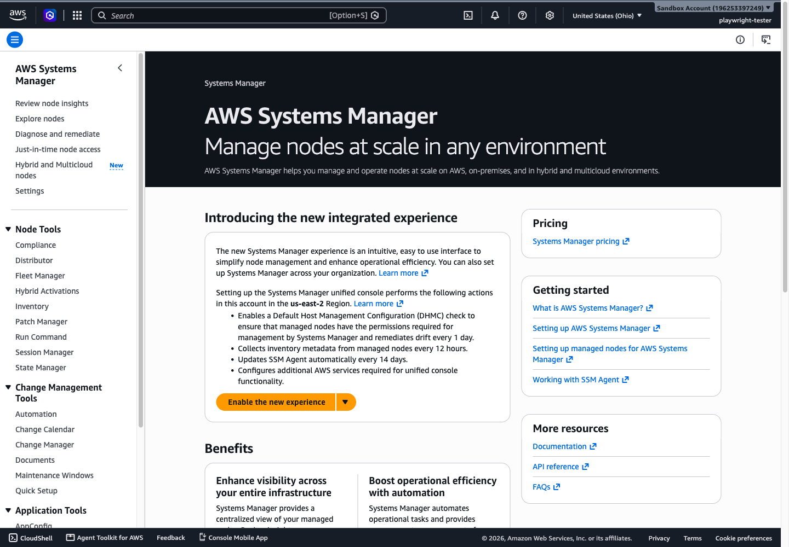

# AWS Systems Manager (SSM)

AWS Systems Manager (SSM) is the operations hub for your compute. It gives you one place to view and act on *managed nodes* (EC2 instances, edge devices, on-premises servers, and VMs) across accounts and Regions: run commands, open shell sessions without SSH, patch operating systems, keep software in a known state, store configuration and secrets, and automate remediation. The unifying idea is simple: install the SSM Agent on a node, give it an IAM role, and the node registers with Systems Manager; from then on you operate it remotely through AWS instead of logging in.

## What Systems Manager is

Systems Manager manages two concerns in one service:

- **Node operations.** A fleet view, inventory, patching, remote command and session access, and state enforcement for the machines you run.
- **Operational automation.** Runbooks, maintenance windows, parameter storage, and event-driven remediation that act across AWS resources, not only nodes.

The unified console groups those tools in its left navigation, which is the map this documentation follows. The screenshot below is the Systems Manager home page in the sandbox account.

*The Systems Manager home page. The left navigation groups the tools into Node Tools (Compliance, Distributor, Fleet Manager, Hybrid Activations, Inventory, Patch Manager, Run Command, Session Manager, State Manager), Change Management Tools (Automation, Change Calendar, Documents, Maintenance Windows, Quick Setup), and Application Tools. The numbered documents in this folder follow that grouping.*

Systems Manager is **regional**. A managed node registers with the Systems Manager service in its own Region; it is not managed from another Region's service. Feature coverage is broad but not identical in every Region.

It is effectively a **free service**: AWS does not charge for using Systems Manager itself. You pay for the resources it acts on and for a few optional features that carry their own pricing, such as Parameter Store *advanced* parameters and Automation steps beyond the free tier.

## SOA-C03 relevance

Systems Manager is in scope under **Management and Governance**, and it appears across three domains:

- **Domain 1, Task 1.2**: Skill 1.2.1 (analyze metrics and automate remediation with services such as Systems Manager) and Skill 1.2.3 (create or run custom and predefined Systems Manager Automation runbooks) make SSM a first-class remediation tool.
- **Domain 3, Task 3.2**: Skill 3.2.1 (use AWS services such as Systems Manager to automate operational processes) and Skill 3.2.2 (event-driven automation).
- **Domain 4**: patch and compliance management (Patch Manager, Compliance) and Skill 4.2.4 (securely store secrets, which Parameter Store serves alongside Secrets Manager).

The canonical Systems Manager documentation lives here; domain and cross-service pages link back rather than repeat it.

## Document index (read in this order)

1. [01-fundamentals.md](01-fundamentals.md): the SSM Agent, managed nodes, the instance IAM role, and Default Host Management Configuration.
2. [02-node-tools.md](02-node-tools.md): Fleet Manager, Compliance, Inventory, and Hybrid Activations.
3. [03-session-run-state.md](03-session-run-state.md): Session Manager, Run Command, and State Manager.
4. [04-patch-manager.md](04-patch-manager.md): Patch Manager, patch baselines, and patch groups.
5. [05-distributor.md](05-distributor.md): Distributor packages.
6. [06-change-management.md](06-change-management.md): Automation, Change Calendar, Maintenance Windows, Documents, and Quick Setup.
7. [07-parameter-store.md](07-parameter-store.md): Parameter Store, its tiers, and parameter policies.
8. [08-application-tools.md](08-application-tools.md): Application Manager and AppConfig.
9. [09-resource-groups.md](09-resource-groups.md): Resource Groups.
10. [10-operations-tools.md](10-operations-tools.md): Explorer and OpsCenter.
11. [11-monitoring.md](11-monitoring.md): CloudWatch, CloudTrail, and Config integration.
12. [12-troubleshooting.md](12-troubleshooting.md): diagnosing nodes that will not register or run.
13. [13-comparisons.md](13-comparisons.md): the distinctions that decide exam answers.
14. [14-exam-traps.md](14-exam-traps.md): recurring misconceptions.
15. [15-limits-defaults.md](15-limits-defaults.md): quotas, defaults, and numbers that matter.
16. [16-quick-review.md](16-quick-review.md): the must-know summary.

Each document ends with its own `Sources` section; there is no separate `sources.md`.

## Relationship map

- **Depends On**, EC2 (managed nodes), IAM (the instance role and caller permissions), and the Systems Manager service endpoints the agent contacts.
- **Integrates With**, CloudWatch (metrics and dashboards), AWS Config (compliance records and remediation), EventBridge (event-driven automation), CloudFormation (parameter and resource provisioning), and Secrets Manager (secret storage).
- **Monitored By**, CloudWatch, AWS Config, Systems Manager Compliance, and OpsCenter.
- **Secured By**, IAM (instance role plus caller policies), KMS (Parameter Store `SecureString`), and VPC endpoints for private access without the public internet.
- **Automated By**, EventBridge, Maintenance Windows, AWS Config remediation, and Automation runbooks.

See also (these documents are planned, not yet created):

- Domain 1: Monitoring, Logging, and Remediation
- Domain 3: Deployment, Provisioning, and Automation
- Domain 4: Security and Compliance
- EC2 + Systems Manager (cross-service)

## Sources

- AWS: *What is AWS Systems Manager?*. https://docs.aws.amazon.com/systems-manager/latest/userguide/what-is-systems-manager.html
- AWS: *Working with SSM Agent*. https://docs.aws.amazon.com/systems-manager/latest/userguide/ssm-agent.html
- AWS: *SOA-C03 exam guide, Content Domains 1, 3, and 4*. https://docs.aws.amazon.com/aws-certification/latest/cloudops-engineer-associate-03/cloudops-engineer-associate-03-domain1.html
