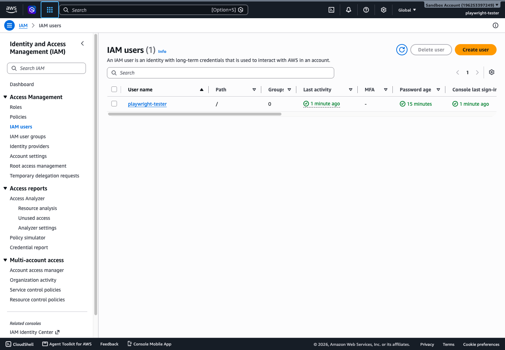
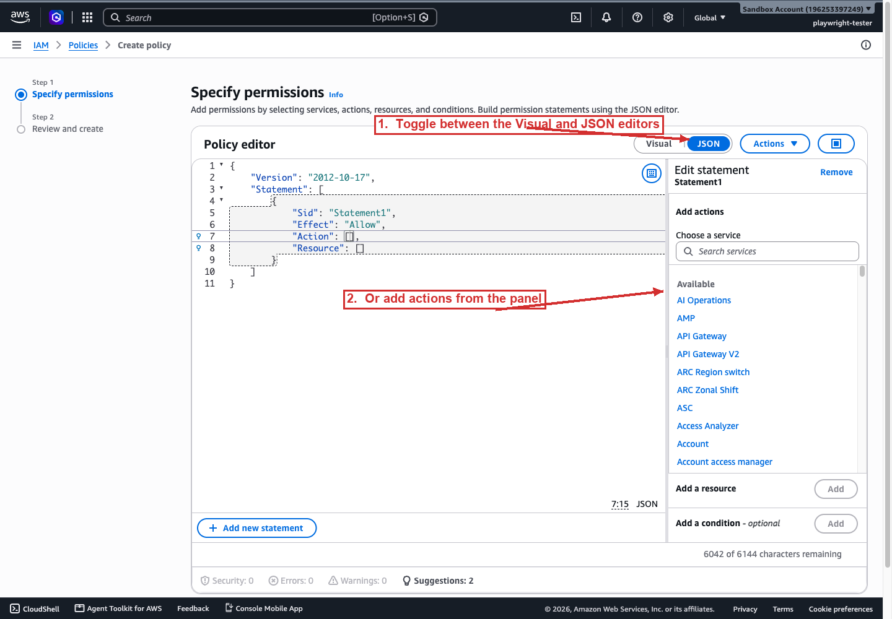
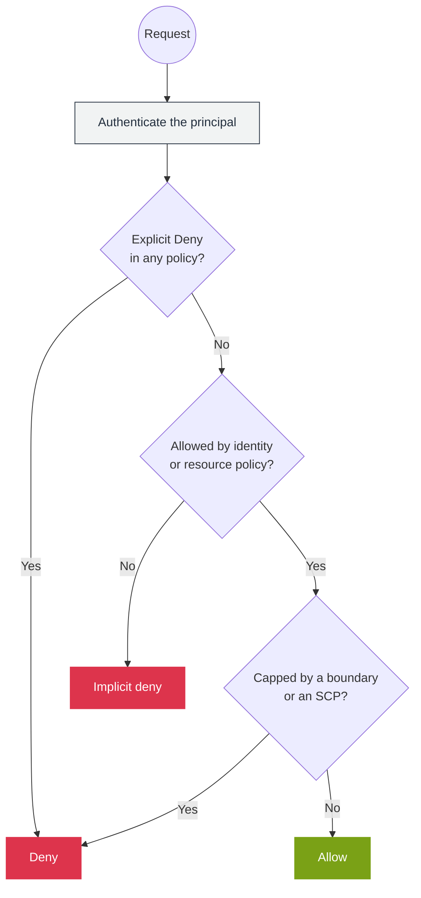
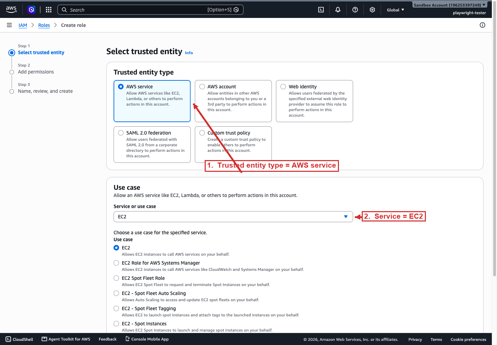
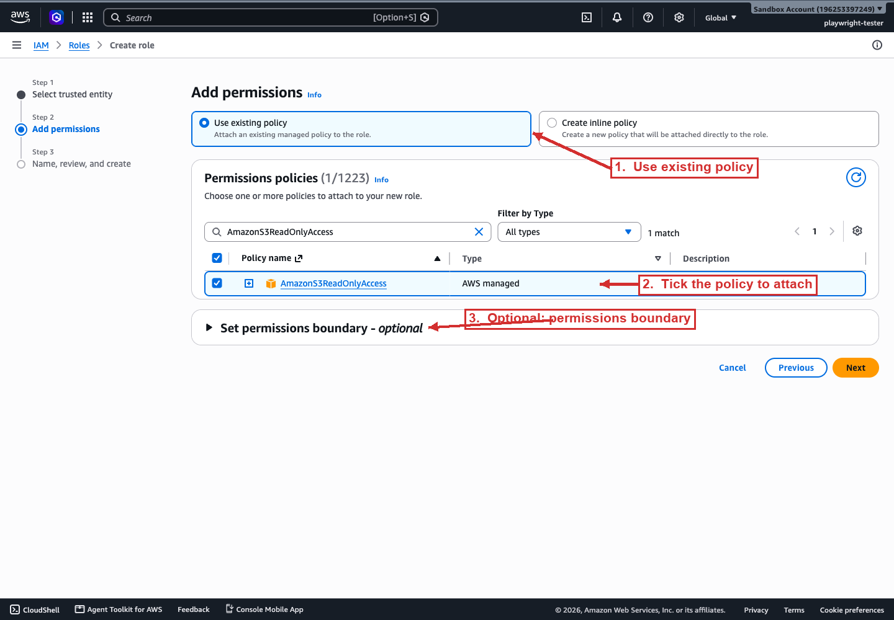
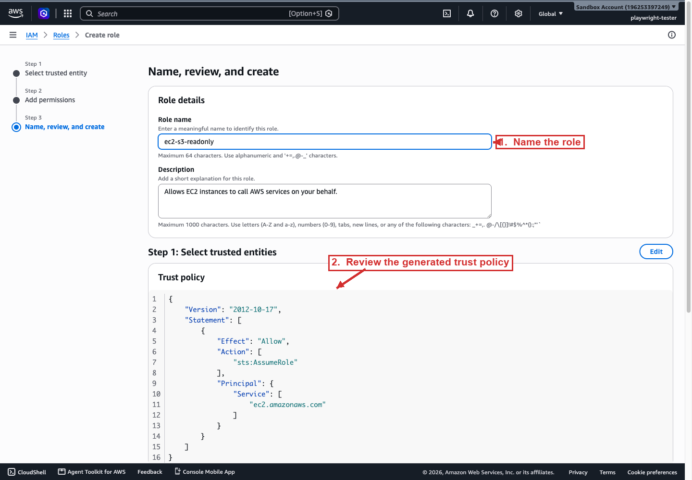

# IAM concepts

> [!IMPORTANT]
> The policy evaluation logic is the highest-yield IAM topic on the exam. Learn three rules cold: (1) **explicit `Deny` always wins**, because a single deny in any policy overrides every allow. (2) **Identity + resource policies are a union**, so an action allowed by either succeeds, and a resource-based grant can work even when the identity policy is empty. (3) **Permissions boundaries and SCPs are intersections**, so they cap what an otherwise-allowed identity can do. Most "why is access denied" questions hinge on misreading which of these three applies.

## Principals

A principal is an entity that can make authenticated requests to AWS.

- **Root user.** Created with the account. Holds full access to all resources. The email + password that opened the account. Not meant for day-to-day work; you protect it with MFA and stop using it.
- **IAM user.** A long-lived identity for a person or service. Authenticates with a password (console) or access keys (CLI/API). Has no permissions by default.
- **IAM role.** An identity you assume, not one you sign in as. Grants *temporary* credentials via AWS STS. Roles are the correct way to give an EC2 instance, a Lambda function, or another AWS account access to resources.
- **Federated identity.** Users from an external IdP (SAML 2.0, OIDC, or IAM Identity Center) that map to roles.



*The IAM Users console. Each row is one long-lived identity; the MFA and Password age columns are how you audit human users at a glance. A user with no MFA and an old, un-rotated password is the finding an attacker wants.*

## Policies

A policy is a JSON document with a list of statements. Each statement has:

- **Effect**, `Allow` or `Deny`.
- **Action**, the service operations (e.g. `s3:GetObject`).
- **Resource**, the ARN the action applies to, or `*`.
- **Condition** (optional), when the statement applies, e.g. `aws:SourceIp`, `aws:PrincipalOrgID`.

A complete statement that lets an application read objects under one bucket prefix, but only when the request arrives through a specific VPC endpoint:

```json
{
  "Version": "2012-10-17",
  "Statement": [{
    "Effect": "Allow",
    "Action": "s3:GetObject",
    "Resource": "arn:aws:s3:::example-bucket/reports/*",
    "Condition": { "StringEquals": { "aws:SourceVpce": "vpce-0abc123" } }
  }]
}
```

Reading it element by element: `Effect: Allow` grants the action; `Action` names one operation (`s3:GetObject`) rather than `s3:*`; `Resource` scopes the grant to the `reports/` prefix, where the trailing `/*` matches every object under it; and `Condition` narrows the grant to traffic that arrives through that VPC endpoint, so the same role used over the public internet is denied. That last clause is what makes this a least-privilege statement and not a broad one.



*The IAM policy editor. A statement can be hand-written in the JSON tab or assembled through the Visual builder (1); the side panel (2) adds services, actions, resources, and conditions without editing the JSON by hand. The editor validates the document and reports errors, warnings, and suggestions as you type.*

Three policy types matter most:

| Type | Attached to | Scope |
|------|-------------|-------|
| Identity-based | user, group, role | what that identity may do |
| Resource-based | a resource (S3 bucket, KMS key, SQS queue) | which principals may act on *that resource* |
| Inline | embedded in a single identity | one identity only |

Managed policies (customer or AWS-managed) are reusable; inline policies are embedded. Identity-based policies can be attached to users, groups, and roles; resource-based policies are written inline on the resource itself.

## Policy evaluation logic

This is the single most testable fact about IAM. When a principal requests an action, AWS combines policies:

- **Identity-based + resource-based** → the result is the **union** of allows. If either policy allows the action, it is allowed.
- **Explicit Deny always wins.** A `Deny` in any applicable policy overrides every `Allow`.
- **Permissions boundary** → the **intersection**. The boundary caps the maximum the identity-based policy can grant.
- **SCP / RCP (Organizations)** → another **intersection** that caps what member-account principals can do.



If no policy explicitly allows an action, the default is **implicit deny**. IAM has no implicit allow.

## Roles in practice

A role has two halves:

- **Trust policy**, who may assume the role (the principal). Written as a resource-based policy on the role.
- **Permissions policy**, what the assumed role may do.

A trust policy that lets the EC2 service assume the role, the trust half of an instance role:

```json
{
  "Version": "2012-10-17",
  "Statement": [{
    "Effect": "Allow",
    "Principal": { "Service": "ec2.amazonaws.com" },
    "Action": "sts:AssumeRole"
  }]
}
```

The `Principal` names `ec2.amazonaws.com`, so only the EC2 service can assume it; swap that for an account ID (`"AWS": "arn:aws:iam::123456789012:root"`) to enable cross-account access. Note there is no `Resource` element, on a role's trust policy the role itself is the resource.

Common trust principals: an AWS service (`ec2.amazonaws.com`), another account ID, or a federated IdP. When you attach a role to an EC2 instance via an **instance profile**, the instance metadata service (IMDS) rotates temporary credentials so the instance never stores long-lived keys.

Creating a role in the console runs through three steps. First, choose who may assume it (the trusted entity):



*Step 1: Select trusted entity. Choosing AWS service (1) and the EC2 use case (2) writes a `Service` principal such as `ec2.amazonaws.com` into the trust policy.*

Then attach what the assumed session may do (the permissions policy):



*Step 2: Add permissions. Choose to attach an existing managed policy (1), tick the policy to attach (2); the permissions boundary (3) is optional and only ever caps the role.*

Finally, name the role and review the generated trust policy before creating it:



*Step 3: Name, review, and create. Type the role name (1) and review the trust policy (2) generated from step 1, where `Principal` is `ec2.amazonaws.com`, before creating the role.*

> [!TIP]
> When a scenario asks how a service or workload gets access, the answer is a **role**, never a long-lived user with static keys. Roles yield temporary STS credentials that AWS rotates automatically; static keys embedded in an instance or committed to a repo are a standing credential-leak risk. For EC2 the role attaches through an **instance profile**, and IMDSv2 should be enforced so the role credentials can't be fetched over the network by an attacker.

## Sources

- AWS: *Policy evaluation logic*. https://docs.aws.amazon.com/IAM/latest/UserGuide/reference_policies_evaluation-logic.html
- AWS: *What is IAM?*. https://docs.aws.amazon.com/IAM/latest/UserGuide/introduction.html
- AWS: *SOA-C03 exam guide, Content Domain 4*. https://docs.aws.amazon.com/aws-certification/latest/sysops-administrator-associate-03/sysops-administrator-associate-03-domain4.html
