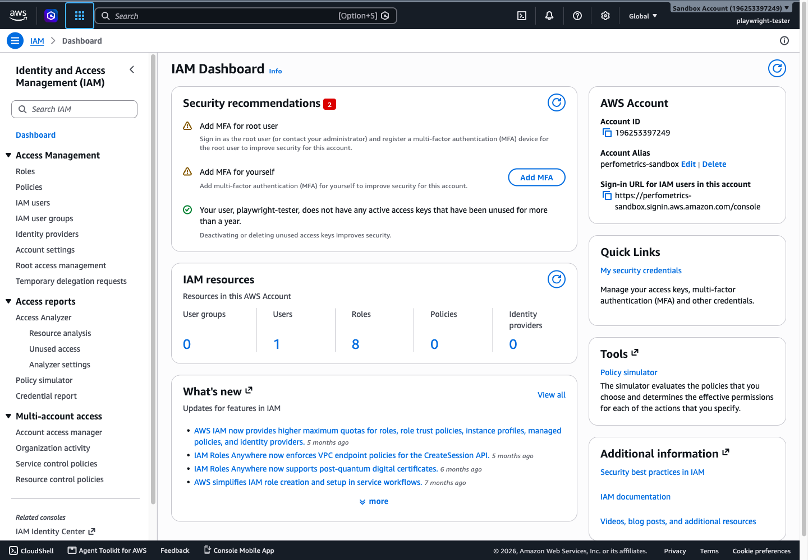
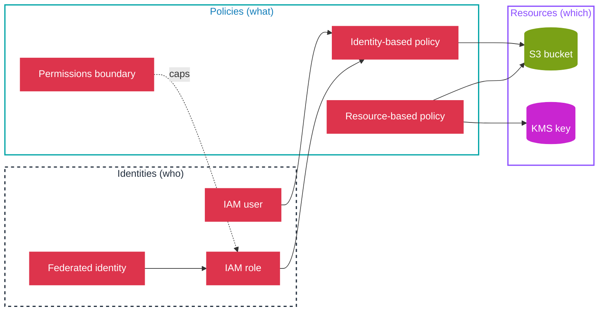

# AWS Identity and Access Management (IAM)

IAM is the AWS service that controls *who* (identity) can do *what* (permission) on *which* resources. Every other service in this repository assumes IAM in some form: an EC2 instance assumes a role to read an S3 bucket, a CloudFormation stack assumes a role to create resources, a user assumes a role to reach a database. It is the dependency that precedes everything else, which is why it is documented first.

## What IAM is

IAM manages two concerns in one service:

- **Authentication (who you are).** Principals: the root user, IAM users, IAM roles, federated identities. You prove identity with a password, access key, or temporary token.
- **Authorization (what you may do).** Policies attach to principals or resources and grant or deny actions on specific AWS resources.

IAM is global, not regional. Users, roles, and policies exist account-wide; a role created in one Region is usable in all Regions.

*The IAM dashboard for the sandbox account. The Security recommendations panel and the resource counts on the left are the first things to check when auditing an account; the AWS Account panel on the right holds the account ID and the sign-in URL for IAM users.*

The pieces fit together as principals, policies, and resources:

## SOA-C03 relevance

IAM is the backbone of **Domain 4: Security and Compliance (16%)**. The exam guide names it directly in three skills:

- **4.1.1**, Implement IAM features: password policies, MFA, roles, federated identity, resource policies, policy conditions.
- **4.1.2**, Troubleshoot and audit access: CloudTrail, IAM Access Analyzer, IAM policy simulator.
- **4.1.3**, Multi-account security: AWS Organizations, SCPs, IAM Identity Center.

IAM is not confined to Domain 4. Roles and instance profiles underpin Domain 3 (deployment/provisioning), and CloudTrail-based audit feeds Domain 1 (monitoring/logging). The canonical documentation lives here; those domains link back rather than repeat it.

## Document index (read in this order)

1. [01-concepts.md](01-concepts.md): principals, policy structure, and the policy evaluation logic.
2. [02-security.md](02-security.md): least privilege, MFA, password policy, permissions boundaries, SCPs.
3. [03-troubleshooting.md](03-troubleshooting.md): diagnosing an access-denied failure.
4. [04-comparisons.md](04-comparisons.md): role vs user, identity vs resource policy, managed vs inline.
5. [05-exam-traps.md](05-exam-traps.md): recurring misconceptions.
6. [06-limits-defaults.md](06-limits-defaults.md): quotas and defaults that matter.
7. [07-quick-review.md](07-quick-review.md): the must-know summary.

Each document ends with its own `Sources` section; there is no separate `sources.md`.

## Relationship map

- **Secured By**, itself (it is the security primitive).
- **Monitored By**, CloudTrail (API calls), IAM Access Analyzer (findings), Trusted Advisor (IAM checks).
- **Commonly Used With**, AWS Organizations, IAM Identity Center, AWS STS, KMS.
- **Automated By**, CloudFormation, CDK (provision roles and policies as code).

See also (cross-service and domain documents are planned, not yet created):

- Domain 4: Security and Compliance
- IAM + KMS (cross-service)
- IAM + Organizations (cross-service)
