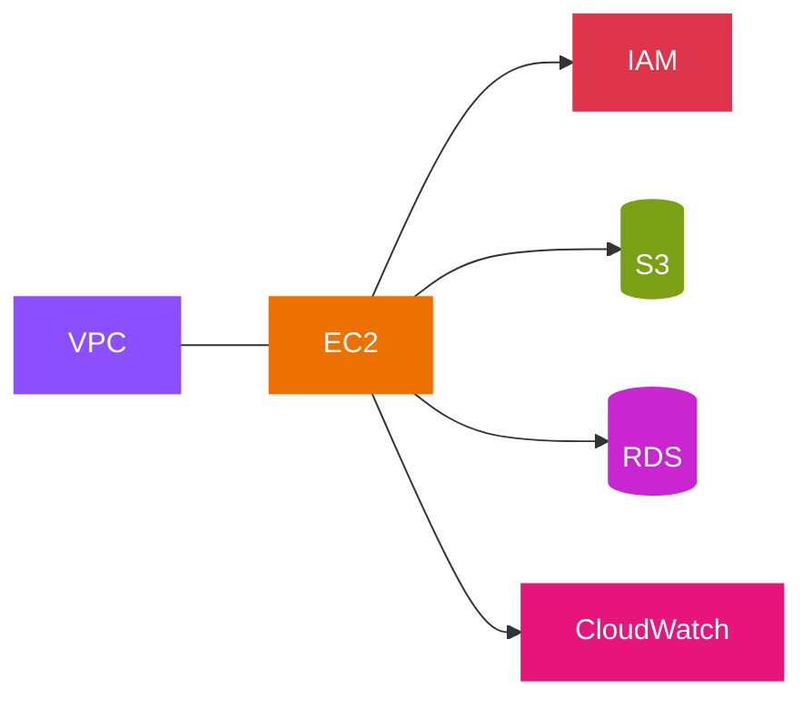
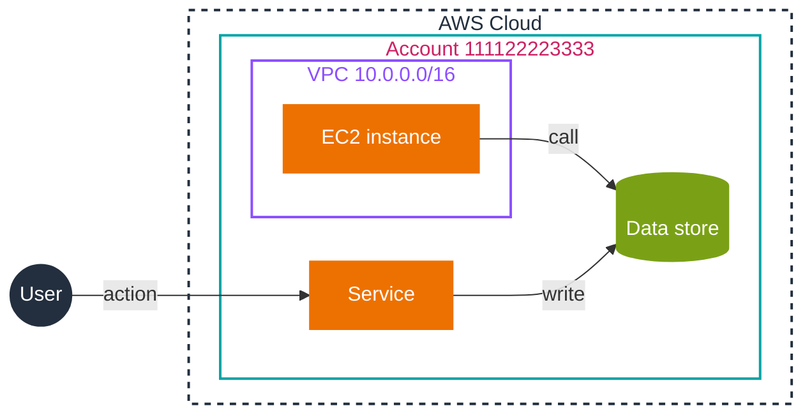

# Mermaid AWS style reference

This file holds the palette, container styles, node styles, and copy-paste templates for making Mermaid diagrams in this repository resemble an AWS reference diagram. The rule that requires this style is §32 of `AGENTS.md`; this file is the lookup table.

The diagrams are read on GitHub, whose built-in Mermaid does not render iconify icons, Font Awesome icons, or the `architecture-beta` diagram type. The style below reproduces the AWS look with three GitHub-safe ingredients: nested `subgraph` containers, the official AWS category colors, and fixed node styles. Real AWS icons are an optional upgrade described at the end.

## Structural colors (containers)

AWS reference diagrams frame every resource in nested boundary boxes. Reproduce that with `subgraph` plus a `style` line. Verified against the AWS architecture icon deck (light background).

| Boundary | Stroke | Font color | Style line |
|----------|--------|-----------|------------|
| AWS Cloud | `#232F3E` dashed | `#232F3E` | `style CLOUD fill:#ffffff,stroke:#232F3E,stroke-width:2px,stroke-dasharray:5 5,color:#232F3E` |
| Region | `#00A4A6` | `#147EBA` | `style REGION fill:#ffffff,stroke:#00A4A6,stroke-width:2px,color:#147EBA` |
| Availability Zone | `#00A4A6` dashed | `#147EBA` | `style AZ fill:#ffffff,stroke:#00A4A6,stroke-dasharray:3 3,color:#147EBA` |
| Account | `#00A4A6` | `#CD2264` | `style ACCT fill:#ffffff,stroke:#00A4A6,stroke-width:2px,color:#CD2264` |
| VPC | `#8C4FFF` | `#8C4FFF` | `style VPC fill:#ffffff,stroke:#8C4FFF,stroke-width:2px,color:#8C4FFF` |
| Public subnet | `#248814` | `#248814` | `style PUB fill:#ffffff,stroke:#248814,color:#248814` |
| Private subnet | `#00A4A6` | `#147EBA` | `style PRIV fill:#ffffff,stroke:#00A4A6,color:#147EBA` |
| Security group | `#DD3522` dashed | `#DD3522` | `style SG fill:#ffffff,stroke:#DD3522,stroke-dasharray:3 3,color:#DD3522` |
| External / third party | `#7D8998` dashed | `#7D8998` | `style EXT fill:#ffffff,stroke:#7D8998,stroke-dasharray:3 3,color:#7D8998` |

Nest the boundaries from largest to smallest: Cloud, then Region, then account, then VPC, then subnet. Keep container fills white so inner nodes stay readable.

## Category colors (service nodes)

AWS gives every service icon a solid category tile. In Mermaid, fill the node with the category hex and use white text. Colors verified against the 2026 AWS architecture icon deck.

| Category | Hex | Example services |
|----------|-----|------------------|
| Compute, Containers, Serverless | `#ED7100` | EC2, Lambda, ECS, EKS, Fargate |
| Storage | `#7AA116` | S3, EBS, EFS, FSx, Backup |
| Database | `#C925D1` | RDS, Aurora, DynamoDB, ElastiCache |
| Networking and Content Delivery | `#8C4FFF` | VPC, ELB, Route 53, CloudFront, API Gateway |
| Analytics | `#8C4FFF` | Athena, EMR, Kinesis, Data Firehose |
| Security, Identity, and Compliance | `#DD344C` | IAM, KMS, GuardDuty, WAF, Secrets Manager |
| Application Integration | `#E7157B` | SNS, SQS, EventBridge, Step Functions |
| Management and Governance | `#E7157B` | CloudWatch, CloudTrail, CloudFormation, Config |
| Artificial Intelligence | `#01A88D` | Bedrock, SageMaker |
| Migration and Modernization | `#01A88D` | DataSync, Transfer Family |

Analytics shares `#8C4FFF` with Networking, and Application Integration shares `#E7157B` with Management and Governance. Two categories sharing a hex is correct, they are grouped that way in the AWS palette.

## Node styles (non-service nodes)

Every node carries one of these styles, so none is left at the default Mermaid theme.

| Node | Fill | Stroke | Text |
|------|------|--------|------|
| Process or step | `#F1F3F3` | `#232F3E` | `#232F3E` |
| Decision | `#ffffff` | `#232F3E` | `#232F3E` |
| Actor or start | `#232F3E` | `#232F3E` | `#ffffff` |
| Allow or success | `#7AA116` | `#7AA116` | `#ffffff` |
| Deny or failure | `#DD344C` | `#DD344C` | `#ffffff` |

## classDef template

Paste the definitions a diagram uses, then tag each node with `class`:



The `:::className` shorthand and the trailing `class Node className` line both work; use whichever reads cleaner.

## Shapes

| Meaning | Syntax | Renders as |
|---------|--------|-----------|
| Service | `A["Label"]` | rectangle |
| Service (rounded) | `A("Label")` | rounded rectangle |
| Data store, database | `A[("Label")]` | cylinder |
| Decision | `A{"Question?"}` | rhombus |
| Actor, start, end | `A(("Label"))` | circle |
| Subroutine, external system | `A[["Label"]]` | double-edged box |

## Full template

Copy this skeleton and fill it in. It renders on GitHub as-is.



## Optional upgrade: real AWS icons

If these files are later rendered where icon packs are supported (the VS Code Mermaid preview, mermaid.live, or Mermaid Chart), the same topology can be redrawn as an `architecture-beta` diagram using the iconify AWS icons. This does **not** render on GitHub, so it is an opt-in only.

The syntax uses `logos:aws-*` icons. It is shown as plain text on purpose: wrapped in a ```mermaid fence, GitHub would try to render it and fail.

```text
architecture-beta
    group cloud(cloud)[AWS Cloud]
    service ec2(logos:aws-ec2)[EC2] in cloud
    service s3(logos:aws-s3)[S3] in cloud
    service cw(logos:aws-cloudwatch)[CloudWatch] in cloud
    ec2:R --> L:s3
    ec2:B --> T:cw
```

A standard Mermaid build resolves `logos:aws-*` only after the `logos` icon pack is registered. With the ESM build:

```javascript
import mermaid from 'https://cdn.jsdelivr.net/npm/mermaid@11/dist/mermaid.esm.min.mjs';
mermaid.registerIconPacks([
  {
    name: 'logos',
    loader: () => fetch('https://unpkg.com/@iconify-json/logos@1/icons.json').then(r => r.json()),
  },
]);
mermaid.initialize({ startOnLoad: true });
```

Without that registration, every icon renders as a blue `?` placeholder. Mermaid Chart has its own native `aws:` icon codes and needs no registration.

## Sources

- AWS: *Architecture Icons*. https://aws.amazon.com/architecture/icons/
- AWS category colors verified against the AWS Architecture Icons deck (R23-2026.01.30, light background) and the draw.io `aws4` palette; consolidated in the perezjoseph/aws-diagramming-drawio-skill catalog. https://github.com/perezjoseph/aws-diagramming-drawio-skill/blob/main/references/aws-icon-catalog.md
- Mermaid: *Flowcharts Syntax*. https://mermaid.js.org/syntax/flowchart.html
- Mermaid: *Architecture Diagrams (v11.1.0+)*. https://mermaid.js.org/syntax/architecture.html
- Mermaid: *Registering icons*. https://mermaid.js.org/config/icons.html
- Iconify: *SVG Logos* icon set (`logos:aws-*`). https://icon-sets.iconify.design/logos/
- GitHub Docs: *Creating Mermaid diagrams* (supported-feature subset). https://docs.github.com/en/get-started/writing-on-github/working-with-advanced-formatting/creating-diagrams
- Community: GitHub Mermaid feature-support notes (Font Awesome, tooltips, and hyperlinks unsupported). https://gist.github.com/ChristopherA/bffddfdf7b1502215e44cec9fb766dfd
