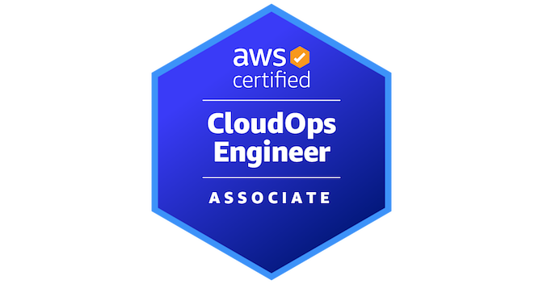

<div align="center">



# ☁️ AWS CloudOps Engineer – Associate (SOA-C03)

**A certification-focused knowledge base for operating workloads on AWS.**

*Research. Verify. Document. Reason like a CloudOps engineer.*


</div>

---

## 🎯 What this is

This repository is a study system for the **AWS Certified CloudOps Engineer – Associate (SOA-C03)** exam — formerly the *AWS Certified SysOps Administrator – Associate*. It is not a collection of copied AWS documentation. It is a knowledge graph that connects the exam's requirements, official AWS behavior, real-world operational practice, and cross-service relationships into one navigable reference.

The goal is to understand **how AWS services actually behave** and **how to reason about them as an operator**, not just to memorize feature lists.

---

## 📊 Exam domains

| # | Domain | Weight |
|---|--------|--------|
| 1 | Monitoring, Logging, Analysis, Remediation, and Performance Optimization | 22% |
| 2 | Reliability and Business Continuity | 22% |
| 3 | Deployment, Provisioning, and Automation | 22% |
| 4 | Security and Compliance | 16% |
| 5 | Networking and Content Delivery | 18% |

> The in-scope AWS service list is non-exhaustive and changes over time. Never treat a static list as the complete exam definition.

---

## 📁 Repository structure

```
aws-cloudops-soa-c03/
├── 00-certification/     Exam guide, domains, tasks, skills, in/out-of-scope services
├── 01-services/          Canonical documentation for individual AWS services
├── 02-concepts/          Cross-cutting principles (networking, security, reliability…)
├── 03-cross-service/     Service + service relationship documents
├── 04-domains/           Knowledge maps for the five exam domains
├── 05-scenarios/         Original scenario-based reasoning exercises
├── 06-labs/              Hands-on exercises and walkthroughs
├── 07-cheatsheets/       Quick-review material for last-minute revision
├── 08-reference/         Whitepapers, prescriptive guidance, glossary
├── assets/               Images, diagrams, and Mermaid sources
└── 99-archive/           Deprecated, historical, and SOA-C02 material
```

Folders and files carry numeric prefixes that encode the read sequence (e.g. `01-services/13-security-identity-compliance/01-iam/`). `README.md` is the only file without a prefix — it is the entry point of its folder.

### How the layers relate

- **`01-services/`** answers *"What is this AWS service and how do I operate it?"*
- **`02-concepts/`** answers *"What is this fundamental CloudOps principle across AWS?"*
- **`03-cross-service/`** answers *"What happens when two or more services interact?"*
- **`04-domains/`** maps that knowledge onto the exam's tasks and skills.

Each major concept has **one canonical home**. Related documents link to it rather than duplicating it.

---

## 🧭 How to use this repository

1. Start with [`00-certification/`](00-certification/) for the exam overview and study strategy.
2. Study a service or concept from `01-services/` or `02-concepts/`.
3. Reinforce it through the corresponding `03-cross-service/` relationship and `04-domains/` context.
4. Test your reasoning with `05-scenarios/` and build muscle memory in `06-labs/`.
5. Before the exam, review with `07-cheatsheets/`.

The complete research, architecture, and writing methodology is defined in [`AGENTS.md`](AGENTS.md).

---

## 💡 Key principles

- **Canonical knowledge** — one source of truth per concept, linked, never duplicated.
- **Certification-first** — every document maps to a specific SOA-C03 domain, task, or skill.
- **Verified facts** — defaults, limits, and quotas are checked against current AWS documentation, never invented.
- **Original scenarios** — no exam dumps; reasoning exercises built from public AWS knowledge.
- **Cross-service thinking** — the exam rewards understanding how services compose, not isolated memorization.

---

<div align="center">

**Certification guide:** [AWS Certified CloudOps Engineer – Associate](https://aws.amazon.com/certification/certified-cloudops-engineer-associate/)

</div>
